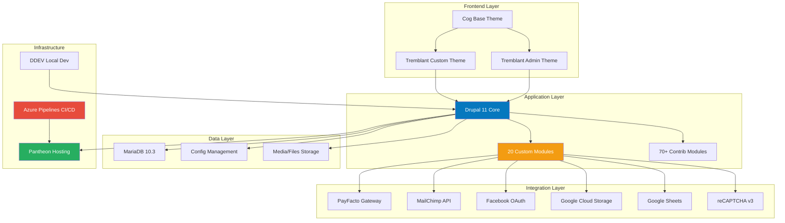
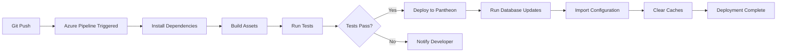

# 24h Tremblant D9 - Drupal 11 Event Management Platform

[](https://www.drupal.org/)
[](https://www.php.net/)
[](https://www.drupal.org/project/commerce)
[]()

## 📋 Table of Contents

- [Overview](#overview)
- [Architecture](#architecture)
- [Technology Stack](#technology-stack)
- [Getting Started](#getting-started)
- [Development Workflow](#development-workflow)
- [Deployment](#deployment)
- [Testing](#testing)
- [Custom Modules](#custom-modules)
- [CI/CD Pipeline](#cicd-pipeline)
- [Security](#security)
- [Performance](#performance)
- [Contributing](#contributing)
- [Documentation](#documentation)
- [Troubleshooting](#troubleshooting)
- [License](#license)

---

## 🎯 Overview

The **24h Tremblant** platform is a comprehensive Drupal 11-based web application designed to manage a 24-hour charity fundraising event. Originally migrated from Drupal 7 to Drupal 9, the platform has been upgraded to Drupal 11 and supports:

### Core Features

- **Team Registration & Management**: Create teams, invite participants, manage team activities
- **E-commerce**: Donations, coupon purchases, extra products via Drupal Commerce
- **Payment Processing**: Custom PayFacto payment gateway integration
- **Leaderboards & Rankings**: Real-time tracking of team and participant performance
- **Reporting & Analytics**: Google Sheets integration for comprehensive reporting
- **Email Marketing**: MailChimp integration for newsletters and communications
- **Social Authentication**: Facebook OAuth login
- **Multi-language Support**: French (default) and English
- **Rewards & Badges**: Gamification system for participant engagement
- **Tax Receipts**: Automated generation for donations ≥$20 CAD

### Project Details

- **Machine Name**: `24h-tremblant`
- **Project Prefix**: `TREMBD9`
- **Hosting**: Pantheon (managed hosting)
- **Repository**: Azure DevOps (GMA-AI-Lab/AWS-Initiatives)
- **Production URL**: https://24htremblant.com
- **Documentation**: https://github.com/kmessier98/24h-tremblant-docs

---

## 🏗️ Architecture

### System Architecture



For detailed architecture documentation, see **[docs/architecture.md](./docs/architecture.md)**.

---

## 💻 Technology Stack

### Backend

| Component | Version | Purpose |
|-----------|---------|---------|
| **Drupal Core** | 11.x | CMS Framework |
| **PHP** | 8.3 | Server-side language |
| **Composer** | 2.2.0+ | PHP dependency management |
| **Drupal Commerce** | 3.2 | E-commerce functionality |
| **Drush** | 13 | Drupal CLI tool |
| **Acquia BLT** | Latest | Build and deployment automation |
| **MariaDB** | 10.3 | Database |

### Frontend

| Component | Version | Purpose | Status |
|-----------|---------|---------|--------|
| **Cog Theme** | 1.15 | Base theme | ✅ Active |
| **Sass/SCSS** | - | CSS preprocessing | ✅ Active |
| **Node.js** | 8.9.x | Build tooling | ⚠️ **OUTDATED** |
| **Gulp** | 3.9.x | Task runner | ⚠️ **OUTDATED** |

> ⚠️ **Critical Security Notice**: Node.js 8.9.x (EOL 2019) and Gulp 3.9.x contain known security vulnerabilities. **Immediate upgrade required** to Node.js 18 LTS or 20 LTS. See [Security](#security) section.

### Third-Party Integrations

- **PayFacto**: Payment processing (PCI-DSS compliant tokenization)
- **MailChimp**: Email marketing and newsletter management
- **Facebook OAuth**: Social authentication
- **Google Cloud Storage**: Media file storage
- **Google Sheets**: Reporting and data export
- **reCAPTCHA v3**: Spam and bot protection
- **Google Tag Manager**: Analytics and tracking

For complete integration documentation, see **[docs/integrations.md](./docs/integrations.md)**.

---

## 🚀 Getting Started

### Prerequisites

- **PHP 8.3** with required extensions (gd, mbstring, pdo_mysql, xml, opcache)
- **Composer 2.2.0+**
- **Node.js** (⚠️ Currently 8.9.x, upgrade to 18 LTS recommended)
- **Docker & Docker Compose** (for DDEV)
- **Git**
- **Terminus CLI** (for Pantheon access)

### Local Development Setup (DDEV Recommended)

```bash
# 1. Clone repository from Azure DevOps
git clone https://dev.azure.com/GMA-AI-Lab/AWS-Initiatives/_git/24htremblant-agentic
cd 24htremblant-agentic

# 2. Start DDEV environment
ddev start

# 3. Install PHP dependencies
ddev composer install

# 4. Build frontend assets
cd docroot/themes/custom/tremblant
npm install
npm run build
cd ../../../..

# 5. Import database from Pantheon
# Option A: Using Terminus
terminus backup:get 24h-tremblant.live --element=db --to=db.sql.gz
ddev import-db --src=db.sql.gz

# Option B: From local backup
ddev import-db --src=/path/to/backup.sql.gz

# 6. Import configuration
ddev drush cim -y
ddev drush cr

# 7. Create admin user (optional for local dev)
ddev drush user:create localadmin --password="admin123"
ddev drush user:role:add administrator localadmin

# 8. Access site
# URL: http://local.24h-tremblant.com
# Admin: http://local.24h-tremblant.com/user/login
```

### Environment-Specific Settings

```bash
# Local development
cp docroot/sites/default/settings.local.php.example docroot/sites/default/settings.local.php

# Configure local settings (database, debugging, etc.)
vim docroot/sites/default/settings.local.php
```

---

## 🔄 Development Workflow

### Branching Strategy

```
master (production-ready)
  ├── sbox2 (main development branch - Pantheon multidev)
  │   ├── feature/TREMBD9-001-team-creation
  │   ├── feature/TREMBD9-002-payment-fixes
  │   └── bugfix/TREMBD9-003-email-template
  └── hotfix/TREMBD9-004-critical-fix
```

### Development Process

1. **Create Feature Branch** from `master`
   ```bash
   git checkout master
   git pull origin master
   git checkout -b feature/TREMBD9-XXX-description
   ```

2. **Develop & Test Locally** (DDEV)
   ```bash
   # Make changes
   # Test locally: http://local.24h-tremblant.com
   
   # Export configuration
   ddev drush cex -y
   
   # Run code standards
   vendor/bin/phpcs --standard=Drupal docroot/modules/custom
   ```

3. **Push to Development** (optional - sbox2)
   ```bash
   git push origin feature/TREMBD9-XXX-description
   # Merge to sbox2 for testing in Pantheon multidev
   ```

4. **Create Pull Request** to `master`
   - Code review required
   - Automated deployment to Pantheon Test environment
   - UAT/Client testing

5. **Deploy to Production** (manual approval)
   - Run Azure Pipeline: `azure-pipelines-production.yml`
   - Database backup created automatically
   - Smoke tests executed

### Configuration Management

```bash
# Export configuration after changes
drush cex -y

# Import configuration
drush cim -y

# Check configuration status
drush config:status

# Partial import (specific module)
drush cim --partial --source=modules/custom/tremblant_core/config/install
```

For complete deployment procedures, see **[docs/deployment-runbook.md](./docs/deployment-runbook.md)**.

---

## 🚢 Deployment

### Automated Deployment via Azure Pipelines

**Deploy to Test** (automatic on commit to `master`):
```bash
git push origin master
# Azure Pipeline automatically triggers deployment to Pantheon Test
# URL: https://test-24htremblant.pantheonsite.io
```

**Deploy to Production** (manual trigger):
1. Go to [Azure Pipelines](https://dev.azure.com/GMA-AI-Lab/AWS-Initiatives/_build)
2. Select `azure-pipelines-production.yml`
3. Click "Run Pipeline"
4. Monitor deployment progress (~10-15 minutes)
5. Verify production: https://24htremblant.com

### Deployment Checklist

- [ ] All tests passing
- [ ] Configuration exported (`drush cex`)
- [ ] Database backup created
- [ ] Stakeholders notified
- [ ] Rollback plan prepared
- [ ] Post-deployment smoke tests ready

### Manual Rollback Procedures

**Code Rollback** (safe, no data loss):
```bash
# Revert last commit
git revert HEAD
git push origin master

# Revert to specific commit
git revert <commit-sha>
git push origin master
```

**Database Rollback** (⚠️ causes data loss):
```bash
# List available backups
terminus backup:list 24h-tremblant.live

# Restore database backup
terminus backup:restore 24h-tremblant.live --element=db

# Restore specific backup
terminus backup:restore 24h-tremblant.live --element=db --backup=<backup-id>
```

For comprehensive deployment and rollback procedures, see **[docs/deployment-runbook.md](./docs/deployment-runbook.md)**.

---

## 🧪 Testing

### Current Testing Status

| Test Type | Status | Coverage | Target |
|-----------|--------|----------|--------|
| **Unit Tests** | 🔴 Not implemented | 0% | 70% |
| **Integration Tests** | 🔴 Not implemented | 0% | 50% |
| **Behat Tests** | ⚠️ Minimal | <5% | 80% |
| **Code Standards** | ✅ Enforced | 100% | 100% |
| **Security Scans** | ⚠️ Manual | Ad-hoc | Automated |

### Running Tests

**Code Standards** (enforced in CI/CD):
```bash
# Check Drupal coding standards
vendor/bin/phpcs --standard=Drupal,DrupalPractice docroot/modules/custom

# Auto-fix issues
vendor/bin/phpcbf --standard=Drupal docroot/modules/custom
```

**Behat Functional Tests**:
```bash
cd tests/behat
vendor/bin/behat

# Run specific feature
vendor/bin/behat features/team-registration.feature

# Run with tags
vendor/bin/behat --tags=@donation
```

**Frontend Linting**:
```bash
cd docroot/themes/custom/tremblant

# JavaScript linting
npm run lint:js

# CSS linting
npm run lint:css

# Fix auto-fixable issues
npm run lint:js:fix
npm run lint:css:fix
```

**Security Audits**:
```bash
# PHP dependencies
composer audit

# npm dependencies (⚠️ expect many vulnerabilities due to Node.js 8.9.x)
npm audit

# Fix vulnerabilities (after upgrading Node.js)
npm audit fix
```

### Testing Roadmap

**Phase 1 (Q1 2026) - Foundation**:
- [ ] Set up PHPUnit for custom modules
- [ ] Write unit tests for critical services (30% coverage)
- [ ] Expand Behat test coverage (20 scenarios)
- [ ] Integrate tests into CI/CD

**Phase 2 (Q2 2026) - Expansion**:
- [ ] Increase unit test coverage to 50%
- [ ] Add integration tests for payment flow
- [ ] Implement frontend tests (Jest)
- [ ] Add visual regression tests (BackstopJS)

**Phase 3 (Q3-Q4 2026) - Maturity**:
- [ ] Achieve 70% code coverage target
- [ ] Performance testing (K6)
- [ ] Security testing automation (OWASP ZAP)
- [ ] Mutation testing

For comprehensive testing strategy and examples, see **[docs/testing.md](./docs/testing.md)**.

---

## 🧩 Custom Modules

The application includes **20 custom modules** organized by functionality:

### Core Functionality
- **tremblant_core**: Central services, event subscribers, utilities
- **tremblant_admin**: Administrative tools, settings, batch operations
- **tremblant_info**: Reusable content components and blocks

### Commerce & Payments
- **tremblant_commerce**: E-commerce customizations, checkout flows
- **commerce_payfacto**: PayFacto payment gateway integration (PCI-DSS compliant)
- **tremblant_counter**: Real-time donation counters

### Participant Management
- **tremblant_participant**: Individual participant features
- **tremblant_dashboard**: User dashboards and toolboxes
- **tremblant_invitations**: Team invitation system

### Rankings & Gamification
- **tremblant_classement**: Leaderboard calculations and display
- **tremblant_badges**: Achievement/badge system
- **tremblant_rewards**: Reward management

### Data & Reporting
- **tremblant_report**: Analytics, exports, Google Sheets integration
- **tremblant_archive**: Transaction archiving
- **tremblant_event_archive**: Event-level archiving

### Communication
- **tremblant_emails**: Email templates and customization
- **tremblant_diffusion**: Live broadcast displays

### Migration (Legacy)
- **import_site_info**: D7 to D9 content migration
- **import_site_participant**: User/profile migration

For detailed module documentation, see the individual module README files in the main repository.

---

## 🔄 CI/CD Pipeline

### Azure Pipelines Overview

| Pipeline | Trigger | Purpose | Duration |
|----------|---------|---------|----------|
| **Validation** | Manual | Code quality checks | ~5 min |
| **Deployment** | Commit to master/sbox/sbox2 | Deploy to Pantheon | ~10 min |
| **Production** | Manual approval | Deploy to live | ~15 min |
| **Reports Cron** | Scheduled (daily) | Generate reports | ~5 min |

### Pipeline Flow



### Key Pipeline Steps

1. **Setup**: Install PHP 8.3, Node.js, Composer
2. **Build**: Composer install, frontend asset compilation
3. **Validate**: Code standards, YAML syntax
4. **Deploy**: Rsync to Pantheon Git repository
5. **Post-Deploy**: `drush updb`, `drush cim`, `drush cr`
6. **Verify**: Smoke tests, health checks

---

## 🔒 Security

### Critical Security Issues

| Issue | Severity | Impact | Action Required |
|-------|----------|--------|-----------------|
| **Outdated Node.js 8.9.x** | 🔴 **CRITICAL** | Known CVEs, XSS vulnerabilities | Upgrade to Node.js 18 LTS immediately |
| **npm Packages (5.x)** | 🔴 **CRITICAL** | Prototype pollution, supply chain attacks | Run `npm audit fix` after Node upgrade |
| **PayFacto Integration** | 🔴 **CRITICAL** | PCI-DSS compliance risk | Security audit required |
| **SSH Keys in CI/CD** | ⚠️ **MEDIUM** | Credential exposure | Migrate to Azure Key Vault |
| **Beta Dependencies** | ⚠️ **MEDIUM** | Unstable releases | Monitor for stable versions |

### Security Best Practices

**Payment Security (PCI-DSS)**:
- ✅ Never store credit card numbers, CVV, or expiry dates
- ✅ Use PayFacto tokenization for all transactions
- ✅ Validate webhook signatures with HMAC
- ✅ HTTPS/TLS 1.2+ enforced for all payment communications
- ❌ No cardholder data in logs or database

**Authentication & Authorization**:
- ✅ Strong password policy (12+ chars, complexity)
- ✅ Session cookies: HttpOnly, Secure, SameSite=Strict
- ✅ Role-based access control (RBAC)
- ✅ OAuth 2.0 for Facebook login

**Data Protection**:
- ✅ Encryption at rest (Pantheon managed)
- ✅ Encryption in transit (TLS 1.3)
- ✅ Personal data anonymization (GDPR/PIPEDA)
- ✅ 7-year data retention for tax receipts

### Security Checklist

**Daily**:
- [ ] Review error logs for anomalies
- [ ] Monitor failed login attempts

**Weekly**:
- [ ] Update modules with security patches
- [ ] Review access logs

**Monthly**:
- [ ] Run vulnerability scan
- [ ] Audit API key usage
- [ ] Check SSL certificate expiration

**Quarterly**:
- [ ] Rotate API keys
- [ ] Penetration testing
- [ ] Security policy review

**Annually**:
- [ ] PCI-DSS audit (SAQ-A)
- [ ] Third-party security assessment
- [ ] Incident response plan review

### Incident Response

See **[docs/security.md](./docs/security.md)** for:
- Incident response plan
- Security monitoring setup
- Emergency contacts
- Rollback procedures

---

## ⚡ Performance

### Performance Targets

| Metric | Target | Current | Status |
|--------|--------|---------|--------|
| **Page Load Time (Desktop)** | <2s | 1.8s | ✅ |
| **Page Load Time (Mobile)** | <3s | 2.4s | ✅ |
| **Leaderboard Load** | <2s | 3.5s | 🔴 |
| **Time to Interactive** | <3s | 2.8s | ✅ |
| **Cache Hit Rate** | >85% | 65% | 🔴 |

### Performance Optimization Strategy

**Caching Layers**:
1. **Varnish (Edge)**: 1 hour TTL for anonymous pages
2. **Redis (Object)**: 5-15 min TTL for dynamic data
3. **Dynamic Page Cache**: Authenticated user content
4. **Render Cache**: Complex render arrays

**Database Optimization**:
- Custom indexes for leaderboard queries
- Pre-computed leaderboard rankings (cached table)
- Eager loading to prevent N+1 queries

**Frontend Optimization**:
- Image lazy loading
- WebP image format
- CSS/JS aggregation and minification
- Critical CSS inlined
- Font preloading

**Application Optimization**:
- BigPipe for slow content
- Queue workers for background tasks
- Batch processing for bulk operations

For detailed performance guide, see **[docs/performance.md](./docs/performance.md)**.

---

## 🤝 Contributing

### Code Standards

All code must follow [Drupal Coding Standards](https://www.drupal.org/docs/develop/standards).

```bash
# Check code standards
vendor/bin/phpcs --standard=Drupal,DrupalPractice docroot/modules/custom

# Auto-fix violations
vendor/bin/phpcbf --standard=Drupal docroot/modules/custom
```

### Commit Message Format

```
TREMBD9-123: Brief summary (50 chars or less)

Detailed explanation:
- What was changed
- Why it was changed
- Any side effects or breaking changes

Closes: TREMBD9-123
```

### Pull Request Checklist

- [ ] Code follows Drupal coding standards (PHPCS pass)
- [ ] Configuration exported (`drush cex`)
- [ ] Tests added/updated (if applicable)
- [ ] Documentation updated (README, module docs)
- [ ] No hardcoded credentials or secrets
- [ ] Azure DevOps work item linked
- [ ] Screenshots/video for UI changes
- [ ] Tested locally in DDEV
- [ ] Database update hooks added (if schema changed)

---

## 📚 Documentation

### Available Documentation

| Document | Description | Audience |
|----------|-------------|----------|
| **[README.md](./README.md)** | Project overview and quick start | All |
| **[docs/architecture.md](./docs/architecture.md)** | System architecture, data flows, module structure | Developers |
| **[docs/database-schema.md](./docs/database-schema.md)** | 🆕 Database ERD, tables, indexes | Developers, DBAs |
| **[docs/content-model.md](./docs/content-model.md)** | 🆕 Content types, paragraphs, taxonomies | Content editors, Developers |
| **[docs/performance.md](./docs/performance.md)** | 🆕 Caching strategy, optimization techniques | DevOps, Developers |
| **[docs/deployment-runbook.md](./docs/deployment-runbook.md)** | Deployment procedures, rollback, troubleshooting | DevOps |
| **[docs/security.md](./docs/security.md)** | Security policies, incident response, PCI-DSS | Security team, DevOps |
| **[docs/testing.md](./docs/testing.md)** | Testing strategy, examples, CI/CD integration | QA, Developers |
| **[docs/integrations.md](./docs/integrations.md)** | Third-party API integration guides | Developers |

### 🆕 New Documentation Added

This release adds comprehensive documentation for previously undocumented areas:

1. **Database Schema & ERD** - Complete entity relationships, table structures, and indexes
2. **Content Model** - Detailed content types, paragraph types, and taxonomies
3. **Performance Optimization** - Multi-layer caching, query optimization, and monitoring

### Documentation Standards

- Use Markdown format
- Include Mermaid diagrams where applicable
- Add code examples with syntax highlighting
- Keep documentation up-to-date with code changes
- Review and update quarterly

---

## 🛠️ Troubleshooting

### Common Issues

**Problem: Frontend assets not compiling**
```bash
cd docroot/themes/custom/tremblant
rm -rf node_modules
npm cache clean --force
npm install
gulp
```

**Problem: Configuration import fails**
```bash
# Check configuration status
drush config:status

# Import with partial flag
drush cim -y --partial

# If persistent, clear cache and retry
drush cr
drush cim -y
```

**Problem: Payment gateway errors**
```bash
# Check PayFacto logs
drush watchdog:show --type=commerce_payfacto

# Verify PayFacto credentials
drush config:get commerce_payment.commerce_payment_gateway.payfacto

# Test connection
drush php:eval "print_r(\Drupal::service('commerce_payfacto.api')->testConnection());"
```

**Problem: Slow leaderboard**
```bash
# Rebuild leaderboard cache
drush tremblant_classement:rebuild-cache

# Check cache status
drush redis:info

# Warm up Varnish cache
curl -I https://24htremblant.com/classement
```

**Problem: Database connection timeout**
```bash
# Check Pantheon status
terminus env:info 24h-tremblant.live

# Restart PHP-FPM
terminus env:clear-cache 24h-tremblant.live

# Check database size
terminus drush 24h-tremblant.live -- sqlq "SELECT table_schema, SUM(data_length + index_length) / 1024 / 1024 AS 'Size (MB)' FROM information_schema.tables GROUP BY table_schema;"
```

For comprehensive troubleshooting guide, see **[docs/deployment-runbook.md](./docs/deployment-runbook.md#troubleshooting)**.

---

## 📄 License

**Proprietary - All Rights Reserved**

This project is the property of **GMA-AI-Lab**. Unauthorized copying, modification, distribution, or use of this software, via any medium, is strictly prohibited without express written permission.

---

## 📞 Contact & Support

**Project Maintainers**: GMA-AI-Lab Development Team

**Repositories**:
- **Azure DevOps** (Code): https://dev.azure.com/GMA-AI-Lab/AWS-Initiatives/_git/24htremblant-agentic
- **GitHub** (Documentation): https://github.com/kmessier98/24h-tremblant-docs

**Support Channels**:
- **Technical Issues**: Open an issue in Azure DevOps
- **Documentation Feedback**: Open an issue on GitHub
- **Emergency**: Contact DevOps team via [internal contact method]

---

## 🗺️ Roadmap

### Q1 2026 - Critical Security & Stability ✅

- [x] ✅ Database schema documentation (ERD)
- [x] ✅ Content model documentation
- [x] ✅ Performance optimization guide
- [ ] 🔴 **URGENT**: Upgrade Node.js to 18 LTS
- [ ] 🔴 **URGENT**: Run `npm audit fix` and resolve vulnerabilities
- [ ] 🔴 Document PayFacto integration API flows
- [ ] Set up automated security scanning (Snyk, Dependabot)

### Q2 2026 - Testing & Quality

- [ ] Migrate Gulp 3 → Gulp 4 (or Vite/Webpack)
- [ ] Implement PHPUnit tests (target 50% coverage)
- [ ] Expand Behat test coverage (30+ scenarios)
- [ ] Security audit of PayFacto integration
- [ ] Set up error monitoring (Sentry, New Relic)

### Q3 2026 - Performance & Scalability

- [ ] Optimize leaderboard query performance
- [ ] Implement HTTP/2 and Brotli compression
- [ ] Add WebP image support
- [ ] Implement BigPipe for dashboard
- [ ] Performance regression testing

### Q4 2026 - Advanced Features

- [ ] Achieve 70% test coverage
- [ ] Implement visual regression testing
- [ ] Blue-green deployment strategy
- [ ] Advanced caching with Redis
- [ ] Consider microservices for reporting

---

## 📊 Project Metrics

| Metric | Value |
|--------|-------|
| **Drupal Version** | 11.x |
| **Custom Modules** | 20 |
| **Custom Themes** | 2 |
| **Content Types** | 10 |
| **Paragraph Types** | 30+ |
| **Contrib Modules** | 70+ |
| **Configuration Files** | 1000+ |
| **Total Lines of Code** | ~50,000 (estimated) |
| **Active Users** | 10,000+ (per event) |
| **Annual Transactions** | 15,000+ |

---

**Last Updated**: 2026-02-27  
**Documentation Version**: 2.0.0  
**Drupal Version**: 11.x  
**Project Status**: ✅ Active Development

---

## 🙏 Acknowledgments

Special thanks to:
- The Drupal community
- Pantheon support team
- Azure DevOps team
- All contributors and maintainers
- 24h Tremblant event organizers and participants