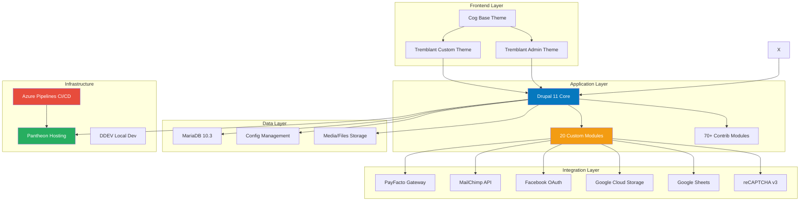

# 24h Tremblant D9 - Drupal 11 Event Management Platform

[](https://www.drupal.org/)
[](https://www.php.net/)
[](https://www.drupal.org/project/commerce)
[]()

## 📋 Table of Contents

- [Overview](#overview)
- [Architecture](#architecture)
- [Technology Stack](#technology-stack)
- [Getting Started](#getting-started)
- [Development Workflow](#development-workflow)
- [Deployment](#deployment)
- [Testing](#testing)
- [Custom Modules](#custom-modules)
- [CI/CD Pipeline](#cicd-pipeline)
- [Security](#security)
- [Contributing](#contributing)
- [Documentation](#documentation)
- [Troubleshooting](#troubleshooting)
- [License](#license)

---

## 🎯 Overview

The **24h Tremblant** platform is a comprehensive Drupal 11-based web application designed to manage a 24-hour charity event. Originally migrated from Drupal 7 to Drupal 9, the platform has been upgraded to Drupal 11 and supports:

- **Team Registration & Management**: Create teams, invite participants, manage team activities
- **E-commerce**: Donations, coupon purchases, extra products via Drupal Commerce
- **Payment Processing**: Custom PayFacto payment gateway integration
- **Leaderboards & Rankings**: Real-time tracking of team and participant performance
- **Reporting & Analytics**: Google Sheets integration for comprehensive reporting
- **Email Marketing**: MailChimp integration for newsletters and communications
- **Social Authentication**: Facebook OAuth login
- **Multi-language Support**: French (default) and English
- **Rewards & Badges**: Gamification system for participant engagement

**Project Details:**
- **Machine Name**: `24h-tremblant`
- **Project Prefix**: `TREMBD9`
- **Hosting**: Pantheon
- **Repository**: Azure DevOps (GMA-AI-Lab/AWS-Initiatives)

---

## 🏗️ Architecture

### System Architecture



For detailed architecture documentation, see [docs/architecture.md](./docs/architecture.md).

---

## 💻 Technology Stack

### Backend
| Component | Version | Purpose |
|-----------|---------|---------|
| **Drupal Core** | 11.x | CMS Framework |
| **PHP** | 8.3 | Server-side language |
| **Composer** | 2.2.0+ | PHP dependency management |
| **Drupal Commerce** | 3.2 | E-commerce functionality |
| **Drush** | 13 | Drupal CLI tool |
| **Acquia BLT** | Latest | Build and deployment automation |

### Frontend
| Component | Version | Purpose |
|-----------|---------|---------|
| **Cog Theme** | 1.15 | Base theme |
| **Sass/SCSS** | - | CSS preprocessing |
| **Node.js** | 8.9.x ⚠️ **OUTDATED** | Build tooling |
| **Gulp** | 3.9.x ⚠️ **OUTDATED** | Task runner |

> ⚠️ **Critical**: Node.js 8.9.x and Gulp 3.9.x are severely outdated. See [Security Concerns](#security).

### Integrations
- **PayFacto**: Payment processing
- **MailChimp**: Email marketing
- **Facebook OAuth**: Social authentication
- **Google Cloud Storage**: File storage
- **Google Sheets**: Reporting export
- **reCAPTCHA v3**: Spam protection

For complete integration documentation, see [docs/integrations.md](./docs/integrations.md).

---

## 🚀 Getting Started

### Prerequisites

- **PHP 8.3** (with required extensions)
- **Composer 2.2.0+**
- **Node.js 8.9.x** (⚠️ or preferably upgrade to 18 LTS / 20 LTS)
- **Docker & Docker Compose** (for DDEV)
- **Git**

### Local Development Setup (DDEV Recommended)

```bash
# 1. Clone repository
git clone https://dev.azure.com/GMA-AI-Lab/AWS-Initiatives/_git/24htremblant-agentic
cd 24htremblant-agentic

# 2. Start DDEV
ddev start

# 3. Install dependencies
ddev composer install

# 4. Build frontend
cd docroot/themes/custom/tremblant
npm install
npm run build

# 5. Import database
terminus backup:get 24h-tremblant.live --element=db --to=db.sql.gz
ddev import-db --src=db.sql.gz

# 6. Import configuration
ddev drush cim -y
ddev drush cr

# 7. Access site
# URL: http://local.24h-tremblant.com
```

For detailed setup instructions, see the main README in the project repository.

---

## 🔄 Development Workflow

### Branching Strategy

```
master (production-ready)
  ├── sbox2 (main development branch)
  │   ├── feature/TREMBD9-001-team-creation
  │   ├── feature/TREMBD9-002-payment-fixes
  │   └── bugfix/TREMBD9-003-email-template
  └── hotfix/TREMBD9-004-critical-fix
```

### Deployment Flow

1. Developer creates feature branch from `master`
2. Optionally merge to `sbox2` for testing
3. Create PR to `master` → auto-deploys to Pantheon Test
4. Manual approval → deploy to Pantheon Live

For complete deployment procedures, see [docs/deployment-runbook.md](./docs/deployment-runbook.md).

---

## 🚢 Deployment

### Automated Deployment (Azure Pipelines)

**Deploy to Test** (automatic on commit to master):
```bash
git push origin master
# Azure Pipeline triggers automatically
```

**Deploy to Production** (manual trigger):
1. Go to Azure Pipelines
2. Run `azure-pipelines-production.yml`
3. Monitor deployment (~15 minutes)

### Manual Rollback

```bash
# Code rollback
git revert HEAD
git push origin master

# Database rollback (⚠️ causes data loss)
terminus backup:restore 24h-tremblant.live --element=db
```

For comprehensive deployment and rollback procedures, see [docs/deployment-runbook.md](./docs/deployment-runbook.md).

---

## 🧪 Testing

### Current Status

| Test Type | Status | Coverage |
|-----------|--------|----------|
| **Unit Tests** | ❌ Not implemented | 0% |
| **Integration Tests** | ❌ Not implemented | 0% |
| **Behat Tests** | ⚠️ Minimal | <5% |
| **Code Standards** | ✅ Enforced | 100% |

### Running Tests

```bash
# Code standards
vendor/bin/phpcs --standard=Drupal docroot/modules/custom

# Behat (functional tests)
cd tests/behat
vendor/bin/behat

# Frontend linting
cd docroot/themes/custom/tremblant
npm run lint:js
npm run lint:css
```

For comprehensive testing strategy and implementation guides, see [docs/testing.md](./docs/testing.md).

---

## 🧩 Custom Modules

The application includes **20 custom modules** organized by functionality:

### Core Functionality
- **tremblant_core**: Central services, event subscribers
- **tremblant_admin**: Administrative tools and settings
- **tremblant_info**: Reusable content components

### Commerce & Payments
- **tremblant_commerce**: E-commerce customizations
- **commerce_payfacto**: PayFacto payment gateway
- **tremblant_counter**: Donation counters

### Participant Management
- **tremblant_participant**: Individual features
- **tremblant_dashboard**: User dashboards
- **tremblant_invitations**: Team invitations

### Rankings & Gamification
- **tremblant_classement**: Leaderboards
- **tremblant_badges**: Achievement system
- **tremblant_rewards**: Reward management

### Data & Reporting
- **tremblant_report**: Analytics and exports
- **tremblant_archive**: Transaction archiving
- **tremblant_event_archive**: Event-level archiving

### Communication
- **tremblant_emails**: Email templates
- **tremblant_diffusion**: Live broadcast displays

For detailed module documentation, see the individual module README files in the main repository.

---

## 🔄 CI/CD Pipeline

### Azure Pipelines

| Pipeline | Trigger | Purpose |
|----------|---------|---------|
| **Validation** | Manual | Code quality checks |
| **Deployment** | Commit to master/sbox/sbox2 | Deploy to Pantheon |
| **Production** | Manual | Deploy to live |
| **Reports Cron** | Scheduled | Generate reports |

### Pipeline Flow

```
Commit → Azure Pipeline → Build → Deploy to Pantheon → drush updb/cim/cr → Verify
```

---

## 🔒 Security

### Critical Security Issues

| Issue | Severity | Recommendation |
|-------|----------|----------------|
| **Outdated Node.js** | 🔴 CRITICAL | Upgrade to Node.js 18 LTS immediately |
| **Old npm Packages** | 🔴 CRITICAL | Run `npm audit fix` |
| **PayFacto Integration** | 🔴 CRITICAL | Security audit required |

### Security Best Practices

- Never store credit card data (only tokens)
- Validate all webhooks
- Use HTTPS everywhere
- Rotate API keys quarterly
- Conduct annual PCI-DSS audit

For comprehensive security guide, see [docs/security.md](./docs/security.md).

---

## 🤝 Contributing

### Code Standards

```bash
# Check code
vendor/bin/phpcs --standard=Drupal,DrupalPractice docroot/modules/custom

# Auto-fix
vendor/bin/phpcbf --standard=Drupal docroot/modules/custom
```

### Commit Message Format

```
TREMBD9-123: Brief summary (50 chars or less)

Detailed explanation:
- What was changed
- Why it was changed
- Any side effects

Closes: TREMBD9-123
```

### Pull Request Checklist

- [ ] Code follows Drupal coding standards
- [ ] Configuration exported (`drush cex`)
- [ ] Tests added/updated
- [ ] Documentation updated
- [ ] No hardcoded credentials
- [ ] Azure work item linked

---

## 📚 Documentation

### Available Documentation

| Document | Description |
|----------|-------------|
| **README.md** | This file - project overview |
| **[docs/architecture.md](./docs/architecture.md)** | System architecture and design |
| **[docs/deployment-runbook.md](./docs/deployment-runbook.md)** | Deployment procedures and rollback |
| **[docs/security.md](./docs/security.md)** | Security policies and best practices |
| **[docs/testing.md](./docs/testing.md)** | Testing strategy and examples |
| **[docs/integrations.md](./docs/integrations.md)** | Third-party API integration guides |

### Documentation Gaps

**Critical**:
- Database schema/ERD not documented
- PayFacto integration API flow needs documentation

**Medium Priority**:
- Performance optimization guidelines
- Content model documentation
- User guides for admin tasks

---

## 🛠️ Troubleshooting

### Common Issues

**Frontend assets not compiling**:
```bash
cd docroot/themes/custom/tremblant
rm -rf node_modules
npm install
gulp
```

**Configuration import fails**:
```bash
drush config:status
drush cim -y --partial
```

**Payment gateway errors**:
```bash
# Check logs
drush watchdog:show --type=commerce_payfacto
```

For comprehensive troubleshooting guide, see [docs/deployment-runbook.md](./docs/deployment-runbook.md#troubleshooting).

---

## 📄 License

**Proprietary - All Rights Reserved**

This project is the property of GMA-AI-Lab. Unauthorized copying, modification, distribution, or use of this software is strictly prohibited.

---

## 📞 Contact & Support

**Project Maintainers**: GMA-AI-Lab Development Team

**Repository**: 
- **Azure DevOps**: https://dev.azure.com/GMA-AI-Lab/AWS-Initiatives/_git/24htremblant-agentic
- **Documentation**: https://github.com/kmessier98/24h-tremblant-docs

---

## 🗺️ Roadmap

### Immediate (Q1 2026)
- [ ] Upgrade Node.js to 18 LTS
- [ ] Run `npm audit fix`
- [ ] Document PayFacto integration
- [ ] Set up automated security scanning

### Short-term (Q2 2026)
- [ ] Migrate Gulp 3 → Gulp 4
- [ ] Implement PHPUnit tests (target 50% coverage)
- [ ] Security audit of PayFacto integration

### Long-term (Q3-Q4 2026)
- [ ] Achieve 70% test coverage
- [ ] Implement visual regression testing
- [ ] Performance optimization

---

**Last Updated**: 2026-02-26  
**Documentation Version**: 1.0.0  
**Drupal Version**: 11.x  
**Project Status**: ✅ Active Development