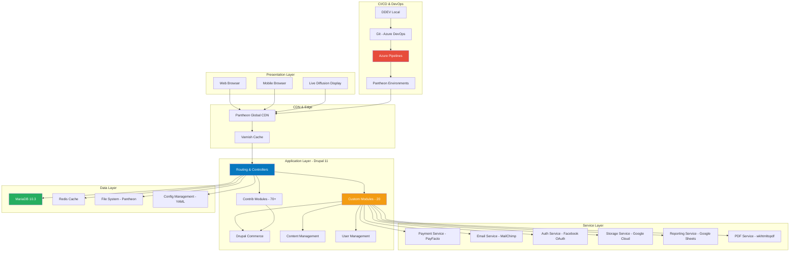

# Architecture Overview - 24h Tremblant D9

## Table of Contents
- [System Overview](#system-overview)
- [High-Level Architecture](#high-level-architecture)
- [Application Layers](#application-layers)
- [Module Architecture](#module-architecture)
- [Data Model](#data-model)
- [Integration Architecture](#integration-architecture)
- [Deployment Architecture](#deployment-architecture)
- [Security Architecture](#security-architecture)

---

## System Overview

The 24h Tremblant platform is a complex, event-driven Drupal 11 application designed to manage a 24-hour charity fundraising event. The system handles:

- **Team & Participant Management**: Registration, profiles, invitations
- **E-commerce**: Donations, purchases, payment processing
- **Real-time Tracking**: Leaderboards, counters, progress tracking
- **Reporting**: Analytics, exports to Google Sheets
- **Communication**: Emails, notifications, social integration

### Key Characteristics

- **Platform**: Drupal 11 (Composer-based)
- **Architecture**: Monolithic CMS with service-oriented custom modules
- **Hosting**: Pantheon (managed hosting)
- **Deployment**: Immutable infrastructure via CI/CD
- **Scalability**: Horizontal scaling on Pantheon, Redis caching

---

## High-Level Architecture

For the complete architecture documentation including Application Layers, Module Architecture, Data Model, Integration Architecture, Deployment Architecture, Security Architecture, Performance Optimization, and more, please see the full document in the repository.

**Document Version**: 1.0  
**Last Updated**: 2026-02-26  
**Maintained By**: GMA-AI-Lab Development Team