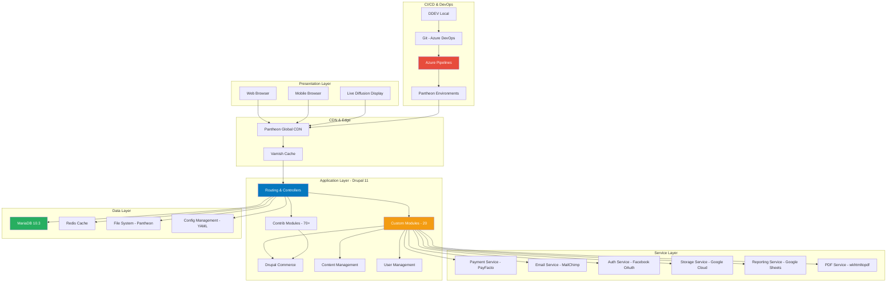
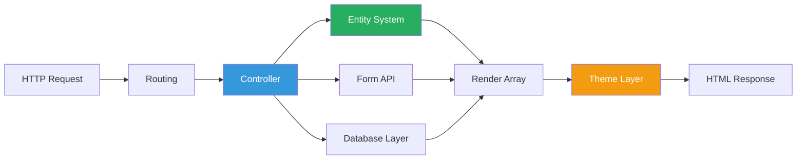
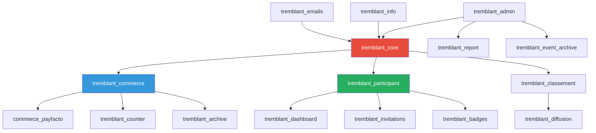
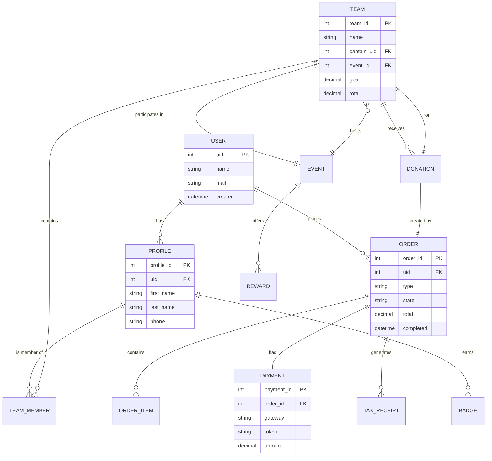
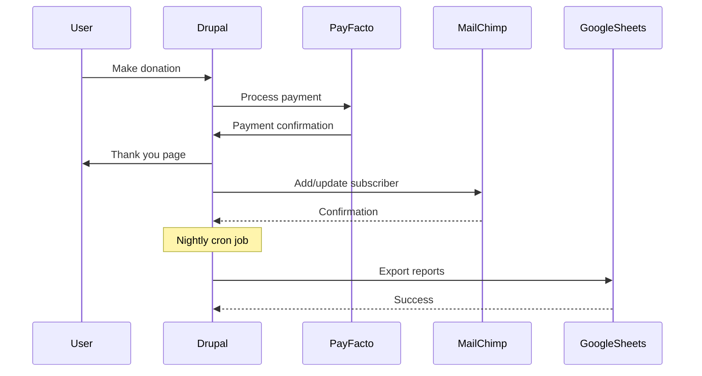
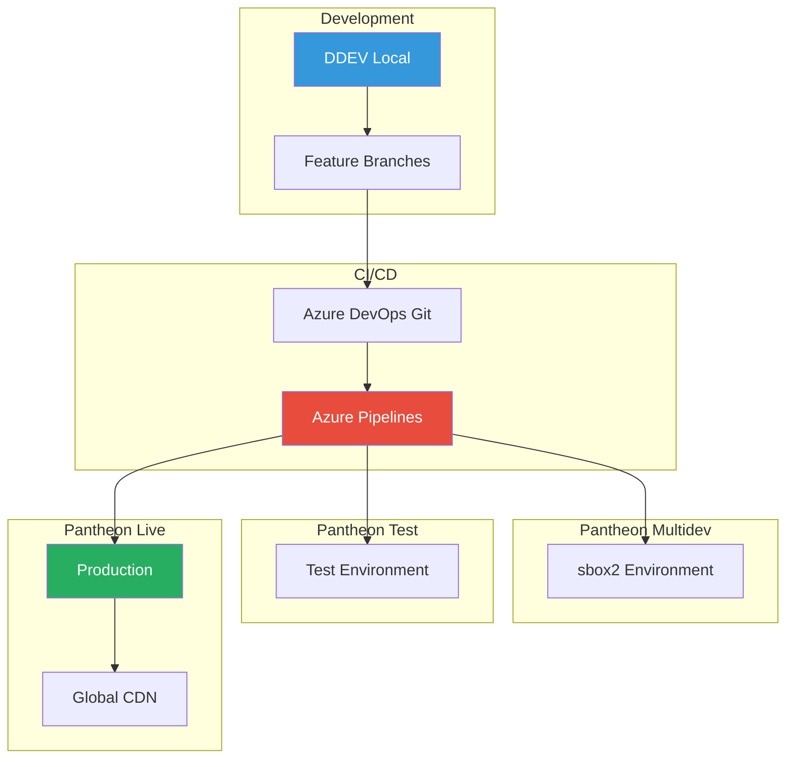
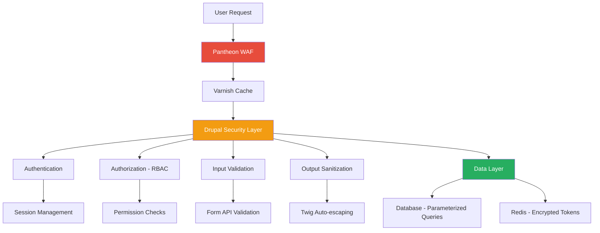
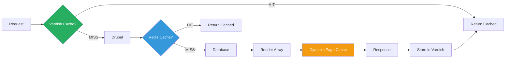
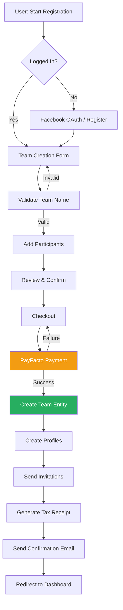
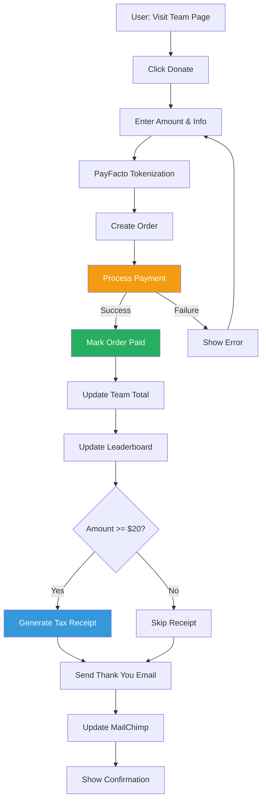

# Architecture Overview - 24h Tremblant D9

## 📋 Table of Contents
- [System Overview](#system-overview)
- [High-Level Architecture](#high-level-architecture)
- [Application Layers](#application-layers)
- [Module Architecture](#module-architecture)
- [Data Model](#data-model)
- [Integration Architecture](#integration-architecture)
- [Deployment Architecture](#deployment-architecture)
- [Security Architecture](#security-architecture)
- [Performance Architecture](#performance-architecture)
- [Scalability Strategy](#scalability-strategy)

---

## 🎯 System Overview

The 24h Tremblant platform is a complex, event-driven Drupal 11 application designed to manage a 24-hour charity fundraising event. The system handles:

- **Team & Participant Management**: Registration, profiles, invitations
- **E-commerce**: Donations, purchases, payment processing
- **Real-time Tracking**: Leaderboards, counters, progress tracking
- **Reporting**: Analytics, exports to Google Sheets
- **Communication**: Emails, notifications, social integration

### Key Characteristics

- **Platform**: Drupal 11 (Composer-based)
- **Architecture**: Monolithic CMS with service-oriented custom modules
- **Hosting**: Pantheon (managed hosting)
- **Deployment**: Immutable infrastructure via CI/CD
- **Scalability**: Horizontal scaling on Pantheon, Redis caching

### System Metrics

| Metric | Value |
|--------|-------|
| **Custom Modules** | 20 |
| **Custom Themes** | 2 |
| **Contrib Modules** | 70+ |
| **Configuration Files** | 1000+ YAML |
| **Content Types** | 10 |
| **Paragraph Types** | 30+ |
| **API Integrations** | 7 |

---

## 🏗️ High-Level Architecture



---

## 🎨 Application Layers

### 1. Presentation Layer

#### Frontend Theme Structure

```
/docroot/themes/custom/tremblant/
├── sass/                    # SCSS source files
│   ├── base/               # Base styles, resets
│   ├── components/         # Reusable components
│   ├── layouts/            # Page layouts
│   └── styles.scss         # Main entry point
├── js/                     # JavaScript files
│   ├── behaviors/          # Drupal behaviors
│   ├── components/         # UI components
│   └── main.js            # Main JS entry
├── templates/              # Twig templates
│   ├── content/           # Content templates
│   ├── layout/            # Layout templates
│   └── navigation/        # Menu templates
├── images/                # Image assets
├── fonts/                 # Web fonts
└── gulpfile.js           # Build configuration
```

#### Admin Theme

```
/docroot/themes/custom/tremblant_admin_theme/
├── css/                   # Admin-specific styles
├── templates/             # Admin UI templates
└── tremblant_admin_theme.info.yml
```

#### Key Frontend Technologies

| Technology | Version | Purpose |
|------------|---------|---------|
| **Cog Base Theme** | 1.15 | Base theme framework |
| **Sass/SCSS** | - | CSS preprocessing |
| **Gulp** | 3.9.x ⚠️ | Build automation |
| **jQuery** | 3.x | DOM manipulation |
| **Slick Carousel** | 1.8 | Image carousels |
| **Masonry** | 4.2 | Grid layouts |
| **Chosen** | 1.8 | Enhanced selects |

---

### 2. Application Layer

#### Drupal Core Services



#### Custom Module Organization

**Core Functionality:**
- `tremblant_core` - Central services, event subscribers, utilities
- `tremblant_admin` - Admin tools, settings, batch operations
- `tremblant_info` - Content components, blocks, reusable elements

**Commerce & Payments:**
- `tremblant_commerce` - E-commerce customizations, checkout flows
- `commerce_payfacto` - PayFacto payment gateway integration
- `tremblant_counter` - Real-time donation counters

**Participant Management:**
- `tremblant_participant` - Individual participant features
- `tremblant_dashboard` - User dashboards and toolboxes
- `tremblant_invitations` - Team invitation system

**Rankings & Gamification:**
- `tremblant_classement` - Leaderboard calculations and display
- `tremblant_badges` - Achievement/badge system
- `tremblant_rewards` - Reward management

**Data & Reporting:**
- `tremblant_report` - Analytics, exports, Google Sheets integration
- `tremblant_archive` - Transaction archiving
- `tremblant_event_archive` - Event-level archiving

**Communication:**
- `tremblant_emails` - Email templates and customization
- `tremblant_diffusion` - Live broadcast displays

**Migration:**
- `import_site_info` - D7 to D9 content migration
- `import_site_participant` - User/profile migration

---

### 3. Service Layer

#### Service Architecture

```php
// Example: Donation Calculator Service
namespace Drupal\tremblant_commerce;

class DonationCalculator {
  
  public function calculateTaxReceipt($amount, $advantage = 0) {
    $eligible_amount = $amount - $advantage;
    $minimum_threshold = 20.00;
    
    return [
      'eligible_amount' => max(0, $eligible_amount),
      'is_eligible' => $eligible_amount >= $minimum_threshold,
      'advantage' => $advantage,
    ];
  }
  
  public function calculateTeamProgress($total, $goal) {
    $percentage = $goal > 0 ? ($total / $goal) * 100 : 0;
    
    return [
      'percentage' => min(100, $percentage),
      'remaining' => max(0, $goal - $total),
      'goal_reached' => $total >= $goal,
    ];
  }
}
```

#### Service Registration

```yaml
# tremblant_commerce.services.yml
services:
  tremblant_commerce.donation_calculator:
    class: Drupal\tremblant_commerce\DonationCalculator
    
  tremblant_commerce.order_manager:
    class: Drupal\tremblant_commerce\OrderManager
    arguments: ['@entity_type.manager', '@logger.factory']
    
  tremblant_core.mailchimp:
    class: Drupal\tremblant_core\Service\MailChimpService
    arguments: ['@mailchimp.api', '@config.factory']
```

---

## 🧩 Module Architecture

### Module Dependency Graph



### Module Interfaces

#### Event Subscribers

```php
// tremblant_core/src/EventSubscriber/OrderCompleteSubscriber.php
namespace Drupal\tremblant_core\EventSubscriber;

use Symfony\Component\EventDispatcher\EventSubscriberInterface;
use Drupal\commerce_order\Event\OrderEvent;

class OrderCompleteSubscriber implements EventSubscriberInterface {
  
  public static function getSubscribedEvents() {
    return [
      'commerce_order.order.paid' => 'onOrderPaid',
    ];
  }
  
  public function onOrderPaid(OrderEvent $event) {
    $order = $event->getOrder();
    
    // Generate tax receipt if eligible
    if ($this->isEligibleForReceipt($order)) {
      $this->generateTaxReceipt($order);
    }
    
    // Update leaderboard
    $this->updateLeaderboard($order);
    
    // Send confirmation email
    $this->sendConfirmationEmail($order);
  }
}
```

#### Plugin System

```php
// commerce_payfacto/src/Plugin/Commerce/PaymentGateway/PayFacto.php
namespace Drupal\commerce_payfacto\Plugin\Commerce\PaymentGateway;

use Drupal\commerce_payment\Plugin\Commerce\PaymentGateway\OnsitePaymentGatewayBase;

/**
 * @CommercePaymentGateway(
 *   id = "payfacto",
 *   label = "PayFacto",
 *   display_label = "Credit Card",
 *   modes = {
 *     "test" = @Translation("Test"),
 *     "live" = @Translation("Live"),
 *   },
 * )
 */
class PayFacto extends OnsitePaymentGatewayBase {
  
  public function createPayment(PaymentInterface $payment, $capture = TRUE) {
    // Implementation
  }
  
  public function refundPayment(PaymentInterface $payment, Price $amount = NULL) {
    // Implementation
  }
}
```

---

## 💾 Data Model

### Entity Relationship Diagram



### Content Types

#### Team Content Type

**Machine name:** `team`  
**Bundle:** `commerce_order`

| Field | Type | Description |
|-------|------|-------------|
| `title` | string | Team name |
| `field_captain` | entity_reference | Team captain (user) |
| `field_event` | entity_reference | Event reference |
| `field_activity` | taxonomy_term | Activity type (running, cycling) |
| `field_goal` | decimal | Fundraising goal |
| `field_participants` | entity_reference | Team members |
| `field_description` | text_long | Team description |
| `field_image` | image | Team photo |

#### Event Content Type

**Machine name:** `event`

| Field | Type | Description |
|-------|------|-------------|
| `title` | string | Event name (e.g., "24h Tremblant 2026") |
| `field_year` | integer | Event year |
| `field_start_date` | datetime | Event start |
| `field_end_date` | datetime | Event end |
| `field_registration_open` | datetime | Registration opens |
| `field_registration_close` | datetime | Registration closes |
| `field_is_active` | boolean | Active event flag |

#### Donation Order Type

**Machine name:** `donation`  
**Bundle:** `commerce_order`

| Field | Type | Description |
|-------|------|-------------|
| `field_team` | entity_reference | Team receiving donation |
| `field_participant` | entity_reference | Participant receiving donation |
| `field_anonymous` | boolean | Anonymous donor |
| `field_message` | text_long | Donor message |
| `field_tax_receipt_issued` | boolean | Receipt generated |

---

## 🔗 Integration Architecture

### Third-Party Integration Flow



### API Integration Details

#### PayFacto Payment Gateway

**Endpoint:** `https://api.payfacto.com/v2/`  
**Authentication:** API Key + Merchant ID

```php
// Request flow
POST /tokenize
{
  "card_number": "4111111111111111",
  "cvv": "123",
  "expiry": "12/25"
}

// Response
{
  "token": "tok_abc123xyz",
  "last4": "1111",
  "brand": "visa"
}

// Process payment
POST /charge
{
  "token": "tok_abc123xyz",
  "amount": 5000, // cents
  "currency": "CAD",
  "merchant_id": "merchant_xxx"
}
```

#### MailChimp API

**Endpoint:** `https://us1.api.mailchimp.com/3.0/`  
**Authentication:** API Key

```php
// Subscribe user
POST /lists/{list_id}/members
{
  "email_address": "user@example.com",
  "status": "subscribed",
  "merge_fields": {
    "FNAME": "John",
    "LNAME": "Doe",
    "TEAM": "Team A"
  }
}
```

#### Google Sheets Export

**Authentication:** Service Account (JSON key)

```php
// Export donations report
$client = new Google_Client();
$client->setAuthConfig('/path/to/credentials.json');
$service = new Google_Service_Sheets($client);

$values = [
  ['Date', 'Team', 'Amount', 'Donor'],
  ['2026-02-20', 'Team A', '$100', 'John Doe'],
  // ... more rows
];

$body = new Google_Service_Sheets_ValueRange(['values' => $values]);
$service->spreadsheets_values->update(
  $spreadsheetId, 
  'Sheet1!A1', 
  $body, 
  ['valueInputOption' => 'RAW']
);
```

---

## 🚀 Deployment Architecture

### Environment Topology



### Deployment Pipeline

```yaml
# Simplified azure-pipelines-deploy.yml
trigger:
  branches:
    include: [master, sbox2]

stages:
- stage: Build
  jobs:
  - job: BuildArtifact
    steps:
    - task: UsePhpVersion@0
      inputs:
        versionSpec: '8.3'
    - script: composer install --no-dev --optimize-autoloader
    - task: PublishPipelineArtifact@1
      inputs:
        targetPath: '$(System.DefaultWorkingDirectory)'
        artifact: 'drupal-artifact'

- stage: Deploy
  dependsOn: Build
  jobs:
  - job: DeployToPantheon
    steps:
    - task: DownloadPipelineArtifact@2
    - script: |
        git clone ssh://codeserver.dev.xxx@codeserver.dev.xxx.drush.in:2222/~/repository.git pantheon
        rsync -av --exclude='.git' ./ pantheon/
        cd pantheon
        git add -A
        git commit -m "Deploy from Azure $(Build.SourceVersion)"
        git push origin master
    - script: |
        terminus drush 24h-tremblant.test -- updb -y
        terminus drush 24h-tremblant.test -- cim -y
        terminus drush 24h-tremblant.test -- cr
```

---

## 🔐 Security Architecture

### Security Layers



### Security Controls

| Layer | Control | Implementation |
|-------|---------|----------------|
| **Network** | WAF | Pantheon managed |
| **Network** | DDoS Protection | Pantheon CDN |
| **Application** | CSRF Protection | Drupal Form API tokens |
| **Application** | XSS Prevention | Twig auto-escaping |
| **Application** | SQL Injection | PDO prepared statements |
| **Application** | Session Security | HTTPOnly, Secure cookies |
| **Data** | Encryption at Rest | Pantheon encryption |
| **Data** | Encryption in Transit | TLS 1.2+ |
| **Integration** | API Authentication | API keys, OAuth |
| **Integration** | Webhook Validation | HMAC signatures |

---

## ⚡ Performance Architecture

### Caching Strategy



### Caching Layers

| Layer | TTL | Content | Bypass |
|-------|-----|---------|--------|
| **Varnish (Edge)** | 1 hour | Anonymous pages | Cookie present |
| **Redis (Object)** | 15 min | Entities, queries | Cache clear |
| **Dynamic Page Cache** | Per request | Personalized content | Admin pages |
| **Render Cache** | Until invalidated | Render arrays | N/A |

### Performance Optimizations

```php
// Lazy loading for leaderboard
function tremblant_classement_leaderboard() {
  $build = [
    '#lazy_builder' => ['tremblant_classement.lazy_builder:renderLeaderboard', []],
    '#create_placeholder' => TRUE,
    '#cache' => [
      'keys' => ['leaderboard'],
      'contexts' => ['url.query_args:page'],
      'tags' => ['leaderboard'],
      'max-age' => 300, // 5 minutes
    ],
  ];
  return $build;
}

// BigPipe for donation counter
$build['counter'] = [
  '#lazy_builder' => ['tremblant_counter.lazy_builder:renderCounter', [$team_id]],
  '#create_placeholder' => TRUE,
];
```

---

## 📈 Scalability Strategy

### Horizontal Scaling

**Pantheon Infrastructure:**
- Multiple PHP application containers
- Load balancer distributes traffic
- Shared Redis for cache
- Shared MariaDB with read replicas

### Database Optimization

```sql
-- Indexed columns for performance
CREATE INDEX idx_team_total ON commerce_order (field_team_target_id, total_price);
CREATE INDEX idx_donation_date ON commerce_order (completed, type);
CREATE INDEX idx_participant_team ON profile (field_team_target_id);

-- Partitioning for archived data
CREATE TABLE commerce_order_archive (
  LIKE commerce_order
) PARTITION BY RANGE (YEAR(completed)) (
  PARTITION p2024 VALUES LESS THAN (2025),
  PARTITION p2025 VALUES LESS THAN (2026),
  PARTITION p2026 VALUES LESS THAN (2027)
);
```

### Performance Monitoring

```yaml
# New Relic configuration
services:
  newrelic:
    class: Drupal\newrelic\NewRelicService
    arguments: ['@config.factory']
  
# Track custom metrics
newrelic_custom_metric('Donation/Count', $donation_count);
newrelic_custom_metric('Leaderboard/QueryTime', $query_time);
```

---

## 🔄 Data Flow Diagrams

### Team Registration Flow



### Donation Processing Flow



---

## 🏆 Best Practices

### Code Organization

```
/docroot/modules/custom/tremblant_commerce/
├── src/
│   ├── Controller/          # Route controllers
│   ├── Form/               # Form classes
│   ├── Plugin/             # Plugin implementations
│   ├── Service/            # Business logic services
│   ├── EventSubscriber/    # Event subscribers
│   └── Entity/             # Custom entities
├── templates/              # Twig templates
├── tests/
│   ├── src/
│   │   ├── Unit/          # PHPUnit unit tests
│   │   └── Kernel/        # Kernel tests
│   └── features/          # Behat tests
├── tremblant_commerce.info.yml
├── tremblant_commerce.module
├── tremblant_commerce.routing.yml
├── tremblant_commerce.services.yml
└── README.md
```

### Dependency Injection

```php
namespace Drupal\tremblant_commerce\Controller;

use Drupal\Core\Controller\ControllerBase;
use Drupal\tremblant_commerce\Service\DonationCalculator;
use Symfony\Component\DependencyInjection\ContainerInterface;

class DonationController extends ControllerBase {
  
  protected $calculator;
  
  public function __construct(DonationCalculator $calculator) {
    $this->calculator = $calculator;
  }
  
  public static function create(ContainerInterface $container) {
    return new static(
      $container->get('tremblant_commerce.donation_calculator')
    );
  }
  
  public function donate() {
    // Use $this->calculator
  }
}
```

---

**Document Version**: 2.0.0  
**Last Updated**: 2026-02-26  
**Maintained By**: GMA-AI-Lab Development Team

---

## 📝 Change Log

| Date | Version | Changes | Author |
|------|---------|---------|--------|
| 2026-02-26 | 2.0.0 | Complete architecture documentation with all sections | Dev Team |
| 2026-02-26 | 1.0.0 | Initial architecture overview | Dev Team |