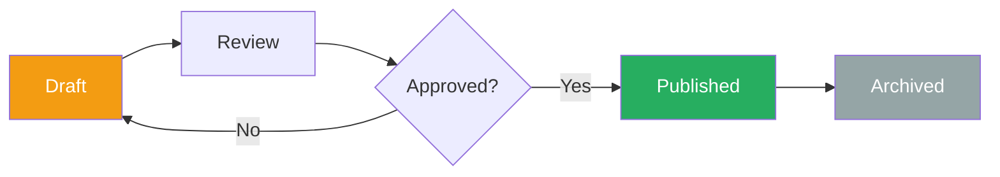
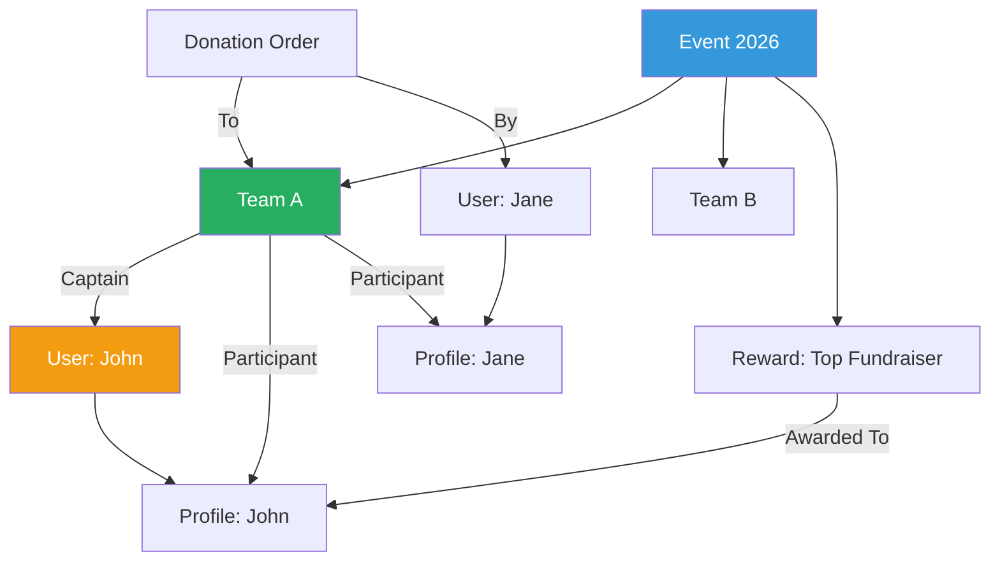

# Content Model Documentation - 24h Tremblant D9

## 📋 Table of Contents

- [Overview](#overview)
- [Content Types](#content-types)
- [Paragraph Types](#paragraph-types)
- [Taxonomy Vocabularies](#taxonomy-vocabularies)
- [Media Types](#media-types)
- [User Roles & Permissions](#user-roles--permissions)
- [Workflow & Moderation](#workflow--moderation)
- [Content Relationships](#content-relationships)

---

## 🎯 Overview

The 24h Tremblant platform uses Drupal's flexible content architecture to manage:
- **10 Content Types** for different entity types
- **30+ Paragraph Types** for flexible, reusable content blocks
- **5 Taxonomy Vocabularies** for categorization
- **4 Media Types** for asset management
- **6 User Roles** with granular permissions

---

## 📄 Content Types

### 1. Event (machine_name: `event`)

**Purpose**: Annual 24h Tremblant event configuration

**Fields**:

| Field Name | Machine Name | Type | Required | Description |
|------------|-------------|------|----------|-------------|
| Title | `title` | Text | ✅ | Event name (e.g., "24h Tremblant 2026") |
| Year | `field_year` | Integer | ✅ | Event year (2026) |
| Start Date | `field_start_date` | Datetime | ✅ | Event start (Feb 21, 2026 6pm) |
| End Date | `field_end_date` | Datetime | ✅ | Event end (Feb 22, 2026 6pm) |
| Registration Open | `field_registration_open` | Datetime | ✅ | When registration opens |
| Registration Close | `field_registration_close` | Datetime | ✅ | When registration closes |
| Is Active | `field_is_active` | Boolean | ✅ | Only one event can be active |
| Description | `field_description` | Text (long, formatted) | ❌ | Event description |
| Hero Image | `field_hero_image` | Media (Image) | ❌ | Main event banner |
| Registration Fee | `field_registration_fee` | Decimal | ✅ | Team registration cost |
| Goal Amount | `field_goal_amount` | Decimal | ❌ | Overall fundraising goal |

**View Modes**:
- Full
- Teaser
- Admin summary

**Example**:
```yaml
title: "24h Tremblant 2026"
field_year: 2026
field_start_date: "2026-02-21T18:00:00"
field_end_date: "2026-02-22T18:00:00"
field_registration_open: "2025-11-01T00:00:00"
field_registration_close: "2026-02-15T23:59:59"
field_is_active: true
field_registration_fee: 100.00
field_goal_amount: 500000.00
```

---

### 2. Team (machine_name: `team`)

**Purpose**: Team registration for event participation

**Fields**:

| Field Name | Machine Name | Type | Required | Description |
|------------|-------------|------|----------|-------------|
| Team Name | `title` | Text | ✅ | Public team name |
| Captain | `field_captain` | Entity Reference (User) | ✅ | Team captain/creator |
| Event | `field_event` | Entity Reference (Node:Event) | ✅ | Which event |
| Activity | `field_activity` | Entity Reference (Taxonomy:Activity) | ✅ | Running, cycling, etc. |
| Goal | `field_goal` | Decimal | ✅ | Fundraising goal |
| Total Raised | `field_total_raised` | Decimal (computed) | ❌ | Auto-calculated |
| Participants | `field_participants` | Entity Reference (Profile) | ❌ | Team members (multi-value) |
| Description | `field_description` | Text (long, formatted) | ❌ | Team story |
| Team Image | `field_team_image` | Media (Image) | ❌ | Team photo |
| Social Links | `field_social_links` | Link (multi-value) | ❌ | Facebook, Twitter, etc. |
| Beneficiary | `field_beneficiary` | Entity Reference (Taxonomy:Beneficiary) | ❌ | Charity beneficiary |
| Created Date | `created` | Timestamp | ✅ | Auto |
| Published | `status` | Boolean | ✅ | Published/unpublished |

**View Modes**:
- Full (team page with donation form)
- Teaser (leaderboard row)
- Card (team grid)
- Admin summary

**Display Settings**:
```yaml
full:
  - field_team_image (responsive_image)
  - field_description (formatted_text)
  - field_captain (rendered profile)
  - field_participants (list with photos)
  - field_goal (formatted_number with progress bar)
  - field_total_raised (formatted_number)
  - donation_form (custom block)

teaser:
  - field_team_image (thumbnail)
  - title (linked)
  - field_total_raised (formatted)
  - field_goal (progress_percentage)
```

**Permissions**:
- **Create**: Authenticated users
- **Edit own**: Team captain
- **Edit any**: Admin, Volunteer
- **Delete**: Admin only

---

### 3. Page (machine_name: `page`)

**Purpose**: Standard informational pages (FAQ, About, etc.)

**Fields**:

| Field Name | Machine Name | Type | Required |
|------------|-------------|------|----------|
| Title | `title` | Text | ✅ |
| Body | `body` | Text (long, formatted) | ✅ |
| Hero Banner | `field_hero_banner` | Paragraph (Hero) | ❌ |
| Content Sections | `field_content_sections` | Paragraph (multi-value) | ❌ |
| Show Breadcrumbs | `field_show_breadcrumbs` | Boolean | ❌ |
| Meta Tags | `field_meta_tags` | Metatag | ❌ |

**Available Paragraphs**:
- Text Block
- Image with Text
- Call to Action
- Accordion/FAQ
- Video Embed
- Statistics Counter
- Partner Logos

---

### 4. Program (machine_name: `program`)

**Purpose**: Different event programs (Kids, Adults, Corporate)

**Fields**:

| Field Name | Machine Name | Type | Required |
|------------|-------------|------|----------|
| Program Name | `title` | Text | ✅ |
| Program Type | `field_program_type` | List (text) | ✅ |
| Description | `field_description` | Text (long, formatted) | ✅ |
| Age Requirement | `field_age_requirement` | Text | ❌ |
| Registration Fee | `field_registration_fee` | Decimal | ❌ |
| Icon | `field_icon` | Media (Image) | ❌ |
| Featured | `field_featured` | Boolean | ❌ |

**Program Types**:
- `kids` - Kids program (ages 6-12)
- `teens` - Teen program (ages 13-17)
- `adults` - Adult program (18+)
- `corporate` - Corporate teams
- `vip` - VIP experience

---

### 5. Grouped Team (machine_name: `grouped_team`)

**Purpose**: Multiple teams under one organization/company

**Fields**:

| Field Name | Machine Name | Type |
|------------|-------------|------|
| Organization Name | `title` | Text |
| Teams | `field_teams` | Entity Reference (Node:Team, multi-value) |
| Contact Person | `field_contact_person` | Entity Reference (User) |
| Logo | `field_logo` | Media (Image) |
| Description | `field_description` | Text (long) |

---

### 6. Reward (machine_name: `reward`)

**Purpose**: Prizes/rewards for top fundraisers

**Fields**:

| Field Name | Machine Name | Type |
|------------|-------------|------|
| Reward Name | `title` | Text |
| Description | `field_description` | Text (long) |
| Image | `field_image` | Media (Image) |
| Threshold Amount | `field_threshold_amount` | Decimal |
| Event | `field_event` | Entity Reference (Node:Event) |
| Recipients | `field_recipients` | Entity Reference (Profile, multi-value) |

---

### 7. Badge (machine_name: `badge`)

**Purpose**: Achievement badges for participants

**Fields**:

| Field Name | Machine Name | Type |
|------------|-------------|------|
| Badge Name | `title` | Text |
| Description | `field_description` | Text |
| Icon | `field_icon` | Media (Image) |
| Criteria | `field_criteria` | Text (long) |
| Badge Type | `field_badge_type` | List (text) |

**Badge Types**:
- `fundraising` - Fundraising milestones
- `participation` - Event participation
- `social` - Social sharing
- `team_building` - Team building
- `special` - Special achievements

---

### 8. Kids Content (machine_name: `kids`)

**Purpose**: Kid-friendly content for junior participants

**Fields**:

| Field Name | Machine Name | Type |
|------------|-------------|------|
| Title | `title` | Text |
| Body | `body` | Text (long, formatted) |
| Featured Image | `field_featured_image` | Media (Image) |
| Activities | `field_activities` | Paragraph (multi-value) |
| Age Group | `field_age_group` | List (text) |

---

### 9. Blog Post (machine_name: `article`)

**Purpose**: News and updates

**Fields**:

| Field Name | Machine Name | Type |
|------------|-------------|------|
| Title | `title` | Text |
| Author | `uid` | Entity Reference (User) |
| Body | `body` | Text (long, formatted) |
| Featured Image | `field_featured_image` | Media (Image) |
| Category | `field_category` | Entity Reference (Taxonomy:Blog Category) |
| Tags | `field_tags` | Entity Reference (Taxonomy:Tags, multi-value) |
| Published Date | `created` | Timestamp |

---

### 10. Webform (machine_name: `webform`)

**Purpose**: Contact forms, surveys, etc.

**Fields**: (Built-in webform module)
- Newsletter subscription
- Contact form
- Volunteer application
- Feedback survey

---

## 📦 Paragraph Types

Paragraphs are reusable, nestable content components used in flexible layouts.

### Content Paragraphs

#### 1. Hero Banner (`hero_banner`)

**Fields**:
- Title (text)
- Subtitle (text)
- Background Image (media:image)
- Background Video (media:video_file)
- CTA Button (link)
- Overlay Opacity (range 0-100)

**Usage**: Top of landing pages

#### 2. Text Block (`text_block`)

**Fields**:
- Title (text, optional)
- Body (text_long, formatted)
- Background Color (color_field)
- Text Alignment (list: left/center/right)

#### 3. Image with Text (`image_text`)

**Fields**:
- Image (media:image)
- Title (text)
- Body (text_long)
- Image Position (list: left/right)
- CTA Link (link)

#### 4. Call to Action (`cta`)

**Fields**:
- Heading (text)
- Description (text)
- Button Text (text)
- Button Link (link)
- Style (list: primary/secondary/outline)

#### 5. Accordion/FAQ (`accordion`)

**Fields**:
- Question (text)
- Answer (text_long, formatted)
- Default Open (boolean)

#### 6. Statistics Counter (`counter`)

**Fields**:
- Number (integer)
- Label (text)
- Icon (media:image)
- Animation (boolean)

#### 7. Team Grid (`team_grid`)

**Fields**:
- Teams (entity_reference: node:team, multi-value)
- Columns (integer: 2/3/4)
- Show Goal (boolean)

#### 8. Donation Thermometer (`donation_thermometer`)

**Fields**:
- Goal Amount (decimal)
- Current Amount (computed)
- Show Percentage (boolean)

#### 9. Video Embed (`video_embed`)

**Fields**:
- Video URL (link)
- Thumbnail (media:image)
- Autoplay (boolean)

#### 10. Partner Logos (`partner_logos`)

**Fields**:
- Partners (entity_reference: taxonomy:partners, multi-value)
- Display Style (list: grid/carousel)

### Layout Paragraphs

#### 11. Two Column (`two_column`)

**Fields**:
- Left Column (entity_reference_revisions: paragraph, multi-value)
- Right Column (entity_reference_revisions: paragraph, multi-value)
- Column Ratio (list: 50/50, 60/40, 40/60)

#### 12. Three Column (`three_column`)

**Fields**:
- Columns (entity_reference_revisions: paragraph, 3 fields)
- Equal Width (boolean)

#### 13. Tab Container (`tab_container`)

**Fields**:
- Tabs (entity_reference_revisions: paragraph:tab, multi-value)

#### 14. Tab (`tab`)

**Fields**:
- Tab Title (text)
- Tab Content (entity_reference_revisions: paragraph, multi-value)

---

## 🏷️ Taxonomy Vocabularies

### 1. Activity (machine_name: `activity`)

**Purpose**: Team activity types

**Terms**:
- Running (Courses)
- Cycling (Vélo)
- Cross-Country Skiing (Ski de fond)
- Snowshoeing (Raquette)
- Mixed (Mixte)

**Fields**:
- Icon (media:image)
- Color Code (color_field)
- Description (text_long)

### 2. Event Categories (machine_name: `event_categories`)

**Terms**:
- Fundraising
- Sports
- Social
- Awards
- Volunteer

### 3. Partners (machine_name: `partners`)

**Purpose**: Event sponsors and partners

**Fields**:
- Partner Name (title)
- Logo (media:image)
- Website (link)
- Partner Level (list: Platinum/Gold/Silver/Bronze)
- Description (text_long)

### 4. Beneficiaries (machine_name: `beneficiaries`)

**Purpose**: Charities supported by the event

**Fields**:
- Charity Name (title)
- Logo (media:image)
- Website (link)
- Description (text_long)
- Mission Statement (text_long)

### 5. Tags (machine_name: `tags`)

**Purpose**: Free tagging for blog posts

---

## 🖼️ Media Types

### 1. Image (machine_name: `image`)

**Fields**:
- Media Name (name)
- Image (image)
- Alt Text (string)
- Caption (text_long)

**Image Styles**:
- Thumbnail (100x100, crop)
- Medium (600x400, scale)
- Large (1200x800, scale)
- Team Photo (800x600, crop)
- Hero Banner (1920x600, crop)

### 2. Video File (machine_name: `video_file`)

**Fields**:
- Media Name (name)
- Video File (file: mp4/webm)
- Thumbnail (image)

### 3. Remote Video (machine_name: `remote_video`)

**Fields**:
- Media Name (name)
- Video URL (string: YouTube/Vimeo)
- Thumbnail (computed)

### 4. Document (machine_name: `document`)

**Fields**:
- Media Name (name)
- File (file: pdf/doc/xlsx)
- Description (text_long)

---

## 👥 User Roles & Permissions

### 1. Anonymous User

**Permissions**:
- ✅ View published content
- ✅ Use donation forms
- ✅ View leaderboards
- ❌ Create content
- ❌ Access admin pages

### 2. Authenticated User

**Permissions**:
- ✅ All Anonymous permissions
- ✅ Create team
- ✅ Edit own profile
- ✅ Join teams
- ✅ Upload profile image
- ❌ Edit teams (unless captain)

### 3. Team Captain

**Permissions**:
- ✅ All Authenticated permissions
- ✅ Edit own team
- ✅ Manage team participants
- ✅ Send team invitations
- ✅ View team reports
- ❌ Edit other teams

### 4. Volunteer

**Permissions**:
- ✅ All Authenticated permissions
- ✅ Edit any team
- ✅ Manage participants
- ✅ View admin reports
- ✅ Moderate content
- ❌ Delete content
- ❌ Access configuration

### 5. Admin 24h

**Permissions**:
- ✅ All Volunteer permissions
- ✅ Create/edit/delete all content
- ✅ Manage users
- ✅ Access site configuration (limited)
- ✅ Generate reports
- ✅ Archive events
- ❌ Change system settings

### 6. Administrator

**Permissions**:
- ✅ Full site access
- ✅ All configuration
- ✅ Module management
- ✅ Database access
- ✅ Deployment

---

## 🔄 Workflow & Moderation

### Content Workflow



### Team Publication Workflow

1. **Draft**: Team created but not published
   - Visible only to captain and admins
   - Can edit freely

2. **Under Review**: Team submitted for approval
   - Reviewed by volunteers/admins
   - Check for inappropriate content

3. **Published**: Team visible to public
   - Appears on leaderboards
   - Can receive donations
   - Limited editing by captain

4. **Archived**: Event ended
   - Read-only
   - Historical record

---

## 🔗 Content Relationships



---

## 📋 Content Entry Best Practices

### Team Creation

```yaml
✅ DO:
  - Use descriptive team names
  - Upload high-quality team photos (min 800x600)
  - Write engaging team description (200-500 words)
  - Set realistic fundraising goals
  - Add social media links

❌ DON'T:
  - Use offensive language
  - Upload copyrighted images
  - Set extremely high unrealistic goals
  - Leave description empty
```

### Page Content

```yaml
✅ DO:
  - Use proper heading hierarchy (H2, H3)
  - Add alt text to all images
  - Keep paragraphs short (3-5 sentences)
  - Use bullet points for lists
  - Add internal links

❌ DON'T:
  - Use inline styles (use CSS classes)
  - Embed external scripts
  - Create walls of text
  - Forget meta descriptions
```

---

**Document Version**: 1.0.0  
**Last Updated**: 2026-02-27  
**Next Review**: 2027-02-27  
**Owner**: Content Team