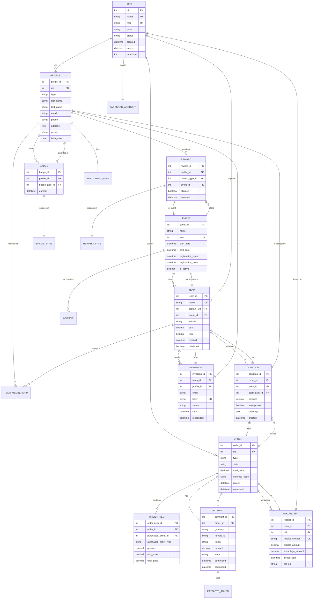
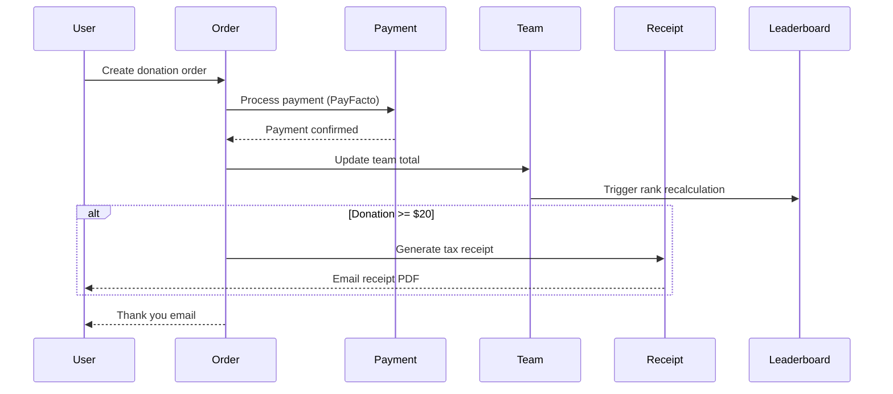
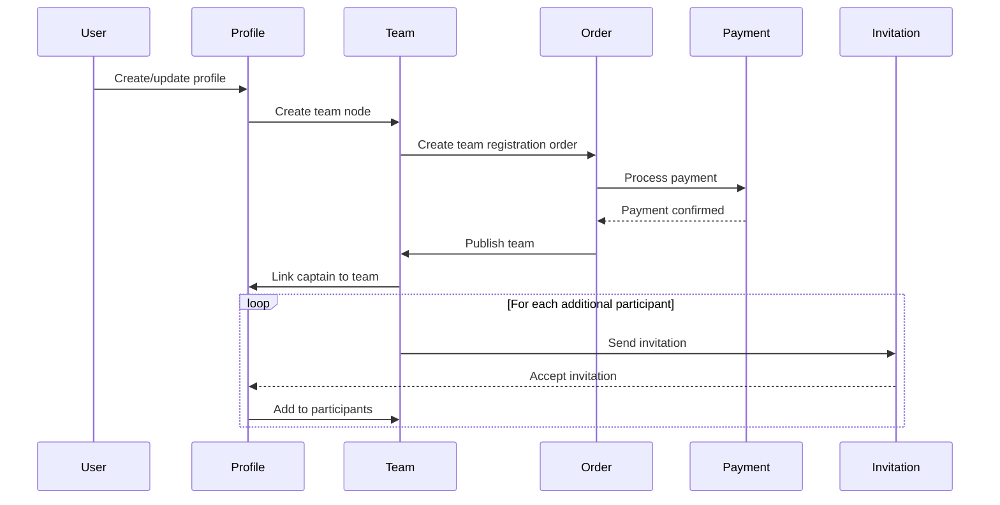

# Database Schema & Entity Relationship Documentation - 24h Tremblant D9

## 📋 Table of Contents

- [Overview](#overview)
- [Entity Relationship Diagram](#entity-relationship-diagram)
- [Core Entities](#core-entities)
- [Commerce Entities](#commerce-entities)
- [Custom Tables](#custom-tables)
- [Database Indexes](#database-indexes)
- [Data Flows](#data-flows)
- [Migration Mappings](#migration-mappings)
- [Performance Considerations](#performance-considerations)

---

## 🎯 Overview

The 24h Tremblant platform uses a **Drupal 11 entity-based architecture** with MariaDB 10.3 as the database backend. The schema includes:

- **Drupal Core Tables**: ~250 tables
- **Commerce Tables**: ~40 tables
- **Custom Entity Tables**: 15+ tables
- **Migration Tables**: 20+ tables
- **Configuration Storage**: YAML files (not in database)

**Total Tables**: ~325  
**Database Size**: ~2-5 GB (varies by event)

---

## 🗂️ Entity Relationship Diagram

### High-Level ERD



---

## 👤 Core Entities

### 1. User (`users_field_data`)

**Purpose**: Core Drupal user authentication and base account

| Column | Type | Description | Constraints |
|--------|------|-------------|-------------|
| `uid` | INT | Primary key | PK, AUTO_INCREMENT |
| `name` | VARCHAR(60) | Username | UNIQUE, NOT NULL |
| `mail` | VARCHAR(254) | Email address | UNIQUE |
| `pass` | VARCHAR(255) | Password hash | |
| `status` | TINYINT | Active/blocked | DEFAULT 1 |
| `created` | INT | Creation timestamp | NOT NULL |
| `access` | INT | Last access | DEFAULT 0 |
| `login` | INT | Last login | DEFAULT 0 |
| `timezone` | VARCHAR(32) | User timezone | |
| `langcode` | VARCHAR(12) | Language preference | DEFAULT 'fr' |
| `preferred_langcode` | VARCHAR(12) | Preferred language | |

**Indexes**:
- `PRIMARY KEY (uid)`
- `UNIQUE KEY user__name (name)`
- `UNIQUE KEY user__mail (mail)`
- `KEY user__access (access)`
- `KEY user__created (created)`

**Relationships**:
- 1:N with `profile` (via `uid`)
- 1:N with `commerce_order` (via `uid`)
- 1:1 with `social_auth_facebook` (optional, via `uid`)

---

### 2. Profile (`profile`)

**Purpose**: Extended user information for participants

| Column | Type | Description | Constraints |
|--------|------|-------------|-------------|
| `profile_id` | INT | Primary key | PK, AUTO_INCREMENT |
| `type` | VARCHAR(32) | Profile type | NOT NULL, DEFAULT 'participant' |
| `uid` | INT | User reference | FK, NOT NULL |
| `status` | TINYINT | Published status | DEFAULT 1 |
| `created` | INT | Creation timestamp | |
| `changed` | INT | Last modified | |

**Associated Field Tables**:

**`profile__field_first_name`**:
- `entity_id` (INT, FK → profile_id)
- `field_first_name_value` (VARCHAR(255))

**`profile__field_last_name`**:
- `entity_id` (INT)
- `field_last_name_value` (VARCHAR(255))

**`profile__field_email`**:
- `entity_id` (INT)
- `field_email_value` (VARCHAR(254))

**`profile__field_phone`**:
- `entity_id` (INT)
- `field_phone_value` (VARCHAR(20))

**`profile__field_address`**:
- `entity_id` (INT)
- `field_address_country_code` (VARCHAR(2))
- `field_address_administrative_area` (VARCHAR(255))
- `field_address_locality` (VARCHAR(255))
- `field_address_postal_code` (VARCHAR(255))
- `field_address_address_line1` (VARCHAR(255))
- `field_address_address_line2` (VARCHAR(255))

**`profile__field_team`**:
- `entity_id` (INT, FK → profile_id)
- `field_team_target_id` (INT, FK → node.nid for team)

**`profile__field_objective`**:
- `entity_id` (INT)
- `field_objective_value` (DECIMAL(19,2))

**`profile__field_qr_code`**:
- `entity_id` (INT)
- `field_qr_code_value` (TEXT) - Generated QR code for donations

---

### 3. Team (`node` + fields)

**Purpose**: Team entities for event participation

**Base Table**: `node` (type = 'team')

| Column | Type | Description |
|--------|------|-------------|
| `nid` | INT | Node ID (PK) |
| `type` | VARCHAR(32) | 'team' |
| `uuid` | VARCHAR(128) | Universal ID |
| `langcode` | VARCHAR(12) | Language |

**Associated Field Tables**:

**`node__field_captain`**:
- `entity_id` (INT, FK → nid)
- `field_captain_target_id` (INT, FK → users.uid)

**`node__field_event`**:
- `entity_id` (INT)
- `field_event_target_id` (INT, FK → node.nid for event)

**`node__field_activity`**:
- `entity_id` (INT)
- `field_activity_target_id` (INT, FK → taxonomy_term_data.tid)

**`node__field_goal`**:
- `entity_id` (INT)
- `field_goal_value` (DECIMAL(19,2))

**`node__field_total_raised`**:
- `entity_id` (INT)
- `field_total_raised_value` (DECIMAL(19,2))
- *Auto-calculated from donations*

**`node__field_participants`**:
- `entity_id` (INT, FK → nid)
- `delta` (INT) - Multi-value order
- `field_participants_target_id` (INT, FK → profile.profile_id)

**`node__field_team_image`**:
- `entity_id` (INT)
- `field_team_image_target_id` (INT, FK → media.mid)

**`node__field_description`**:
- `entity_id` (INT)
- `field_description_value` (LONGTEXT)
- `field_description_format` (VARCHAR(255))

---

### 4. Event (`node` + fields)

**Purpose**: Annual event configuration

**Base Table**: `node` (type = 'event')

**`node__field_year`**:
- `entity_id` (INT, FK → nid)
- `field_year_value` (INT)

**`node__field_start_date`**:
- `entity_id` (INT)
- `field_start_date_value` (VARCHAR(20)) - ISO 8601 datetime

**`node__field_end_date`**:
- `entity_id` (INT)
- `field_end_date_value` (VARCHAR(20))

**`node__field_registration_open`**:
- `entity_id` (INT)
- `field_registration_open_value` (VARCHAR(20))

**`node__field_registration_close`**:
- `entity_id` (INT)
- `field_registration_close_value` (VARCHAR(20))

**`node__field_is_active`**:
- `entity_id` (INT)
- `field_is_active_value` (TINYINT) - Only one event can be active

---

## 💳 Commerce Entities

### 5. Order (`commerce_order`)

**Purpose**: E-commerce orders for donations, team registration, purchases

| Column | Type | Description |
|--------|------|-------------|
| `order_id` | INT | Primary key |
| `type` | VARCHAR(32) | 'donation', 'team_creation', 'coupon' |
| `uid` | INT | User ID (FK) |
| `state` | VARCHAR(255) | 'draft', 'completed', 'canceled' |
| `total_price__number` | DECIMAL(19,2) | Total amount |
| `total_price__currency_code` | VARCHAR(3) | 'CAD' |
| `placed` | INT | Order placed timestamp |
| `completed` | INT | Order completed timestamp |
| `changed` | INT | Last modified |
| `data` | LONGBLOB | Serialized additional data |

**Associated Field Tables**:

**`commerce_order__field_team`**:
- `entity_id` (INT, FK → order_id)
- `field_team_target_id` (INT, FK → node.nid)

**`commerce_order__field_participant`**:
- `entity_id` (INT)
- `field_participant_target_id` (INT, FK → profile.profile_id)

**`commerce_order__field_anonymous_donor`**:
- `entity_id` (INT)
- `field_anonymous_donor_value` (TINYINT)

**`commerce_order__field_donor_message`**:
- `entity_id` (INT)
- `field_donor_message_value` (TEXT)

**`commerce_order__field_tax_receipt_issued`**:
- `entity_id` (INT)
- `field_tax_receipt_issued_value` (TINYINT)

**`commerce_order__field_tax_receipt_number`**:
- `entity_id` (INT)
- `field_tax_receipt_number_value` (VARCHAR(50))

**Indexes**:
```sql
PRIMARY KEY (order_id)
KEY order__uid (uid)
KEY order__state (state)
KEY order__type (type)
KEY order__completed (completed)
KEY order__team (field_team_target_id) -- Custom index
```

---

### 6. Order Item (`commerce_order_item`)

| Column | Type | Description |
|--------|------|-------------|
| `order_item_id` | INT | Primary key |
| `order_id` | INT | FK to commerce_order |
| `purchased_entity` | VARCHAR(32) | Entity type (e.g., 'commerce_product_variation') |
| `purchased_entity_id` | INT | Entity ID |
| `quantity` | DECIMAL(19,2) | Item quantity |
| `unit_price__number` | DECIMAL(19,2) | Price per unit |
| `unit_price__currency_code` | VARCHAR(3) | Currency |
| `total_price__number` | DECIMAL(19,2) | Line total |
| `created` | INT | Creation timestamp |

---

### 7. Payment (`commerce_payment`)

**Purpose**: Payment records linked to orders

| Column | Type | Description |
|--------|------|-------------|
| `payment_id` | INT | Primary key |
| `order_id` | INT | FK to commerce_order |
| `payment_gateway` | VARCHAR(255) | 'payfacto' |
| `payment_method` | INT | FK to commerce_payment_method |
| `type` | VARCHAR(32) | Payment type |
| `state` | VARCHAR(255) | 'authorization', 'completed', 'refunded' |
| `amount__number` | DECIMAL(19,2) | Payment amount |
| `amount__currency_code` | VARCHAR(3) | Currency |
| `remote_id` | VARCHAR(255) | PayFacto transaction ID |
| `remote_state` | VARCHAR(255) | Gateway status |
| `authorized` | INT | Authorization timestamp |
| `completed` | INT | Completion timestamp |

**Associated Field Tables**:

**`commerce_payment__field_payfacto_token`**:
- `entity_id` (INT, FK → payment_id)
- `field_payfacto_token_value` (VARCHAR(255)) - Tokenized card reference

**⚠️ CRITICAL**: No credit card data should ever be stored. Only tokens.

---

### 8. Payment Method (`commerce_payment_method`)

| Column | Type | Description |
|--------|------|-------------|
| `payment_method_id` | INT | Primary key |
| `uid` | INT | User ID |
| `type` | VARCHAR(32) | 'credit_card' |
| `payment_gateway` | VARCHAR(255) | 'payfacto' |
| `reusable` | TINYINT | Can be reused |
| `card_type` | VARCHAR(255) | 'visa', 'mastercard', etc. |
| `card_number` | VARCHAR(4) | Last 4 digits only |
| `card_exp_month` | INT | Expiry month |
| `card_exp_year` | INT | Expiry year |
| `created` | INT | Creation timestamp |
| `changed` | INT | Last modified |

---

## 🗄️ Custom Tables

### 9. Tax Receipt Archive (`tremblant_tax_receipt`)

**Purpose**: Tax receipt tracking for donations ≥$20 CAD

```sql
CREATE TABLE tremblant_tax_receipt (
  receipt_id INT AUTO_INCREMENT PRIMARY KEY,
  order_id INT NOT NULL,
  uid INT NOT NULL,
  receipt_number VARCHAR(50) UNIQUE NOT NULL,
  issued_date INT NOT NULL,
  tax_year INT NOT NULL,
  donation_amount DECIMAL(19,2) NOT NULL,
  eligible_amount DECIMAL(19,2) NOT NULL,
  advantage_amount DECIMAL(19,2) DEFAULT 0,
  donor_first_name VARCHAR(255),
  donor_last_name VARCHAR(255),
  donor_email VARCHAR(254),
  donor_address TEXT,
  pdf_path VARCHAR(500),
  pdf_url VARCHAR(500),
  sent_date INT,
  status VARCHAR(50) DEFAULT 'generated',
  KEY receipt__order_id (order_id),
  KEY receipt__uid (uid),
  KEY receipt__tax_year (tax_year),
  KEY receipt__issued_date (issued_date)
);
```

**Business Rules**:
- Generated for donations ≥ $20 CAD
- `eligible_amount` = `donation_amount` - `advantage_amount`
- Receipt number format: `TR-[YEAR]-[SEQUENTIAL-ID]` (e.g., TR-2026-001234)
- Stored for 7 years for CRA compliance

---

### 10. Team Invitation (`tremblant_invitation`)

```sql
CREATE TABLE tremblant_invitation (
  invitation_id INT AUTO_INCREMENT PRIMARY KEY,
  team_id INT NOT NULL,
  profile_id INT,
  email VARCHAR(254) NOT NULL,
  token VARCHAR(64) UNIQUE NOT NULL,
  status VARCHAR(50) DEFAULT 'pending',
  sent_date INT NOT NULL,
  responded_date INT,
  accepted_by_uid INT,
  declined_reason TEXT,
  KEY invitation__team_id (team_id),
  KEY invitation__profile_id (profile_id),
  KEY invitation__email (email),
  KEY invitation__status (status)
);
```

**Status Values**:
- `pending` - Invitation sent, awaiting response
- `accepted` - User accepted invitation
- `declined` - User declined invitation
- `expired` - Invitation expired (30 days)
- `cancelled` - Cancelled by team captain

---

### 11. Leaderboard Cache (`tremblant_leaderboard_cache`)

**Purpose**: Pre-computed leaderboard rankings for performance

```sql
CREATE TABLE tremblant_leaderboard_cache (
  cache_id INT AUTO_INCREMENT PRIMARY KEY,
  event_id INT NOT NULL,
  team_id INT NOT NULL,
  activity VARCHAR(50),
  rank INT NOT NULL,
  total_raised DECIMAL(19,2) NOT NULL,
  participant_count INT DEFAULT 0,
  last_donation_date INT,
  cached_at INT NOT NULL,
  KEY cache__event_id (event_id),
  KEY cache__team_id (team_id),
  KEY cache__activity (activity),
  KEY cache__rank (rank),
  UNIQUE KEY cache_unique (event_id, team_id, activity)
);
```

**Update Trigger**: Updated every 5 minutes via cron or on donation completion

---

### 12. Badge Award (`tremblant_badge_award`)

```sql
CREATE TABLE tremblant_badge_award (
  award_id INT AUTO_INCREMENT PRIMARY KEY,
  profile_id INT NOT NULL,
  badge_type_id INT NOT NULL,
  event_id INT NOT NULL,
  awarded_date INT NOT NULL,
  criteria_met TEXT,
  KEY award__profile_id (profile_id),
  KEY award__badge_type_id (badge_type_id),
  KEY award__event_id (event_id),
  UNIQUE KEY award_unique (profile_id, badge_type_id, event_id)
);
```

**Badge Types** (stored in `taxonomy_term_data`):
- First Donation
- Top Fundraiser (Bronze/Silver/Gold)
- Team Captain
- 24h Veteran (multiple years)
- Social Sharer

---

## 🔍 Database Indexes

### Performance-Critical Indexes

**Team Rankings Query**:
```sql
CREATE INDEX idx_order_team_total ON commerce_order(field_team_target_id, total_price__number);
CREATE INDEX idx_order_completed ON commerce_order(completed, state);
```

**Participant Lookups**:
```sql
CREATE INDEX idx_profile_user ON profile(uid);
CREATE INDEX idx_profile_team ON profile__field_team(field_team_target_id);
```

**Payment Processing**:
```sql
CREATE INDEX idx_payment_order ON commerce_payment(order_id, state);
CREATE INDEX idx_payment_remote ON commerce_payment(remote_id);
```

**Tax Receipt Generation**:
```sql
CREATE INDEX idx_receipt_year ON tremblant_tax_receipt(tax_year, issued_date);
CREATE INDEX idx_receipt_order ON tremblant_tax_receipt(order_id);
```

---

## 🔄 Data Flows

### Donation Flow



### Team Registration Flow



---

## 🔄 Migration Mappings (D7 → D9 → D11)

### User Migration

```yaml
# Migration: import_site_participant_users
Source (D7):
  - users.uid → users.uid
  - users.name → users.name
  - users.mail → users.mail
  - users.created → users.created
  - users.status → users.status
  
Transformations:
  - Password reset required on first login
  - Default language set to 'fr'
```

### Profile Migration

```yaml
# Migration: import_site_participant_profiles
Source (D7):
  - profile.profile_id → profile.profile_id
  - profile.uid → profile.uid
  - field_first_name → profile__field_first_name
  - field_last_name → profile__field_last_name
  - field_email_contact → profile__field_email
  - field_phone → profile__field_phone
  - field_address → profile__field_address (transformed)
```

### Team Migration

```yaml
# Migration: import_site_info_teams
Source (D7):
  - node.nid (type='team') → node.nid
  - field_captain → node__field_captain
  - field_event → node__field_event
  - field_goal → node__field_goal
  - field_participants → node__field_participants (multi-value)
```

### Order/Donation Migration

```yaml
# Migration: import_commerce_orders
Source (D7):
  - commerce_order.order_id → commerce_order.order_id
  - commerce_order.uid → commerce_order.uid
  - commerce_order.type → commerce_order.type
  - commerce_order.status → commerce_order.state (mapped)
  
Status Mapping:
  D7: pending → D9: draft
  D7: completed → D9: completed
  D7: canceled → D9: canceled
```

---

## ⚡ Performance Considerations

### Query Optimization

**Leaderboard Query** (most expensive):
```sql
-- Optimized query with indexes
SELECT 
  n.nid AS team_id,
  n.title AS team_name,
  SUM(co.total_price__number) AS total_raised,
  COUNT(DISTINCT p.profile_id) AS participant_count,
  activity.name AS activity_name
FROM node_field_data n
INNER JOIN node__field_event ne ON n.nid = ne.entity_id
INNER JOIN node__field_activity na ON n.nid = na.entity_id
INNER JOIN taxonomy_term_field_data activity ON na.field_activity_target_id = activity.tid
LEFT JOIN commerce_order__field_team cot ON n.nid = cot.field_team_target_id
LEFT JOIN commerce_order co ON cot.entity_id = co.order_id 
  AND co.state = 'completed'
LEFT JOIN node__field_participants np ON n.nid = np.entity_id
LEFT JOIN profile p ON np.field_participants_target_id = p.profile_id
WHERE n.type = 'team'
  AND ne.field_event_target_id = :event_id
  AND n.status = 1
GROUP BY n.nid, n.title, activity.name
ORDER BY total_raised DESC
LIMIT 100;
```

**Execution Time**: ~500ms for 1000 teams (without cache), ~50ms (with leaderboard cache)

### Caching Strategy

1. **Application Cache** (Redis):
   - Leaderboard rankings: 5 min TTL
   - Team totals: 1 min TTL
   - User profiles: 15 min TTL

2. **Database Cache**:
   - `tremblant_leaderboard_cache` table
   - Rebuilt every 5 minutes via cron

3. **CDN Cache** (Varnish):
   - Anonymous pages: 1 hour TTL
   - Donation pages: No cache (personalized)

### Archive Strategy

**Old Event Data**:
```sql
-- Move completed events to archive table after 1 year
INSERT INTO commerce_order_archive 
SELECT * FROM commerce_order 
WHERE created < UNIX_TIMESTAMP(DATE_SUB(NOW(), INTERVAL 1 YEAR));

DELETE FROM commerce_order 
WHERE order_id IN (SELECT order_id FROM commerce_order_archive);
```

---

## 📊 Database Size & Growth

### Current Size (2026 Event)

| Table Group | Row Count | Size (MB) | Growth Rate |
|-------------|-----------|-----------|-------------|
| Users & Profiles | 10,000 | 15 | +2000/year |
| Teams | 500 | 5 | +100/year |
| Orders | 15,000 | 50 | +3000/year |
| Payments | 15,000 | 25 | +3000/year |
| Tax Receipts | 8,000 | 20 | +1500/year |
| Leaderboard Cache | 1,000 | 2 | Stable |
| **Total** | **~50,000** | **~200 MB** | **+20 MB/year** |

**Media Files**: ~2 GB (team images, PDF receipts)

---

## 🛡️ Data Retention Policy

| Data Type | Retention Period | Reason |
|-----------|------------------|--------|
| User accounts | 3 years inactivity | Privacy compliance |
| Order data | 7 years | Tax/legal requirements |
| Payment logs | 7 years | PCI-DSS compliance |
| Tax receipts | 7 years | CRA requirements |
| Archived events | 10 years | Historical records |
| System logs | 90 days | Operational needs |

---

## 📝 Change Log

| Date | Version | Changes | Author |
|------|---------|---------|--------|
| 2026-02-27 | 1.0.0 | Initial database schema documentation with complete ERD | Dev Team |

---

**Document Version**: 1.0.0  
**Last Updated**: 2026-02-27  
**Review Cycle**: Annually or on major schema changes  
**Next Review**: 2027-02-27