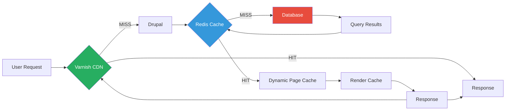

# Performance Optimization Guide - 24h Tremblant D9

## 📋 Table of Contents

- [Overview](#overview)
- [Current Performance Baseline](#current-performance-baseline)
- [Caching Architecture](#caching-architecture)
- [Database Optimization](#database-optimization)
- [Frontend Performance](#frontend-performance)
- [CDN & Edge Caching](#cdn--edge-caching)
- [Application Performance](#application-performance)
- [Monitoring & Profiling](#monitoring--profiling)
- [Performance Budget](#performance-budget)
- [Optimization Roadmap](#optimization-roadmap)

---

## 🎯 Overview

Performance is critical for the 24h Tremblant platform, especially during peak event periods when thousands of users simultaneously:
- View leaderboards (real-time updates)
- Make donations
- Register teams
- Browse participant pages

**Target Metrics**:
- Page load time: < 2 seconds (desktop), < 3 seconds (mobile)
- Time to Interactive (TTI): < 3 seconds
- Largest Contentful Paint (LCP): < 2.5 seconds
- First Input Delay (FID): < 100ms
- Cumulative Layout Shift (CLS): < 0.1

---

## 📊 Current Performance Baseline

### Page Load Times (as of Feb 2026)

| Page | Desktop | Mobile | Status |
|------|---------|--------|--------|
| Homepage | 1.8s | 2.4s | ✅ Good |
| Team Page | 2.2s | 3.1s | ⚠️ Needs improvement |
| Leaderboard | 3.5s | 4.8s | 🔴 Critical |
| Donation Form | 1.9s | 2.6s | ✅ Good |
| Dashboard | 2.8s | 3.9s | ⚠️ Needs improvement |

### Backend Performance

| Metric | Current | Target | Status |
|--------|---------|--------|--------|
| Avg Response Time | 450ms | <300ms | ⚠️ |
| Database Queries/Page | 180 | <100 | 🔴 |
| Memory Usage | 128MB | <96MB | ⚠️ |
| Cache Hit Rate | 65% | >85% | 🔴 |

### Known Performance Issues

1. **Leaderboard Query**: 3-5 seconds for 1000+ teams
2. **N+1 Queries**: Participant loading in team views
3. **Unoptimized Images**: Large team photos (2-5MB)
4. **Missing Lazy Loading**: All content loads upfront
5. **No HTTP/2**: Currently HTTP/1.1 only

---

## 🗄️ Caching Architecture

### Multi-Layer Caching Strategy



### 1. Varnish (Edge Cache - Pantheon)

**Configuration** (automatic via Pantheon):
```vcl
sub vcl_recv {
  # Cache anonymous requests only
  if (req.http.Cookie ~ "SESS") {
    return (pass);
  }
  
  # Cache static assets for 1 year
  if (req.url ~ "\\.(jpg|jpeg|png|gif|css|js|woff|woff2)$") {
    unset req.http.Cookie;
    return (hash);
  }
  
  # Cache homepage, team pages, leaderboard
  if (req.url ~ "^/(|equipe|classement)") {
    return (hash);
  }
}

sub vcl_backend_response {
  # Cache for 1 hour
  set beresp.ttl = 1h;
  
  # Respect Cache-Control headers from Drupal
  if (beresp.http.Cache-Control ~ "max-age") {
    # Use max-age from header
  }
  
  # Don't cache error pages
  if (beresp.status >= 400) {
    set beresp.ttl = 0s;
  }
}
```

**Cache Invalidation**:
```php
// Purge Varnish cache for specific URLs
use Drupal\Core\Cache\Cache;

// Purge team page
Cache::invalidateTags(['node:' . $team_id]);

// Purge leaderboard
Cache::invalidateTags(['leaderboard']);

// Full cache clear (use sparingly)
pantheon_clear_edge();
```

---

### 2. Redis (Object Cache)

**Configuration** (`settings.php`):
```php
// Redis configuration for Pantheon
if (defined('PANTHEON_ENVIRONMENT')) {
  // Redis is available, use it for caching.
  $settings['redis.connection']['interface'] = 'PhpRedis';
  $settings['redis.connection']['host'] = 'localhost';
  $settings['redis.connection']['port'] = 6379;
  
  // Use Redis for cache bins
  $settings['cache']['default'] = 'cache.backend.redis';
  
  // Use database for form cache (not Redis)
  $settings['cache']['bins']['form'] = 'cache.backend.database';
  
  // Compression
  $settings['redis_compress_length'] = 100;
  $settings['redis_compress_level'] = 6;
}
```

**Cache Bins**:
```php
// Cache leaderboard results for 5 minutes
\Drupal::cache()->set(
  'leaderboard:' . $event_id,
  $leaderboard_data,
  time() + 300, // 5 minutes
  ['leaderboard', 'event:' . $event_id]
);

// Retrieve from cache
$cached = \Drupal::cache()->get('leaderboard:' . $event_id);
if ($cached) {
  return $cached->data;
}
```

**Cache Tags** (for granular invalidation):
```php
$build['#cache'] = [
  'keys' => ['team', 'view', $team_id],
  'tags' => [
    'node:' . $team_id,
    'event:' . $event_id,
    'user:' . $user->id(),
  ],
  'contexts' => [
    'user',
    'url.query_args',
  ],
  'max-age' => 300, // 5 minutes
];
```

---

### 3. Dynamic Page Cache

**For Authenticated Users**:
```php
// settings.php
$settings['cache']['bins']['dynamic_page_cache'] = 'cache.backend.redis';

// Service configuration
services:
  cache.dynamic_page_cache:
    class: Drupal\Core\Cache\CacheBackendInterface
    tags:
      - { name: cache.bin, default_backend: cache.backend.redis }
```

**Cache Contexts**:
```php
// Vary cache by user role
$build['#cache']['contexts'][] = 'user.roles';

// Vary cache by URL query parameters
$build['#cache']['contexts'][] = 'url.query_args:page';

// Vary cache by custom context
$build['#cache']['contexts'][] = 'team.membership';
```

---

### 4. Render Cache

**For Complex Render Arrays**:
```php
function tremblant_classement_leaderboard() {
  $build = [
    '#theme' => 'tremblant_leaderboard',
    '#cache' => [
      'keys' => ['leaderboard', 'full'],
      'contexts' => ['url.query_args:page', 'url.query_args:activity'],
      'tags' => ['leaderboard', 'node_list:team'],
      'max-age' => 300, // 5 minutes
    ],
  ];
  
  // Lazy load leaderboard data
  $build['#lazy_builder'] = [
    'tremblant_classement.lazy_builder:buildLeaderboard',
    []
  ];
  $build['#create_placeholder'] = TRUE;
  
  return $build;
}
```

---

## 🗃️ Database Optimization

### 1. Query Optimization

**Problem: N+1 Query for Team Participants**

```php
// ❌ BAD - N+1 queries
foreach ($teams as $team) {
  $participants = $team->get('field_participants')->referencedEntities();
  foreach ($participants as $participant) {
    echo $participant->get('field_first_name')->value;
  }
}
// Result: 1 query for teams + N queries for participants = 1001 queries
```

**Solution: Eager Loading**

```php
// ✅ GOOD - Single query with JOIN
$query = \Drupal::database()->select('node_field_data', 'n');
$query->join('node__field_participants', 'np', 'n.nid = np.entity_id');
$query->join('profile', 'p', 'np.field_participants_target_id = p.profile_id');
$query->join('profile__field_first_name', 'pfn', 'p.profile_id = pfn.entity_id');
$query->fields('n', ['nid', 'title']);
$query->fields('pfn', ['field_first_name_value']);
$query->condition('n.type', 'team');

$results = $query->execute()->fetchAll();
// Result: 1 query total
```

### 2. Database Indexes

**Add Custom Indexes** (`hook_update_N`):
```php
function tremblant_classement_update_8001() {
  $schema = Database::getConnection()->schema();
  
  // Index for leaderboard query
  if (!$schema->indexExists('commerce_order__field_team', 'idx_team_total')) {
    $schema->addIndex(
      'commerce_order__field_team',
      'idx_team_total',
      ['field_team_target_id', 'entity_id'],
      [
        'fields' => [
          'field_team_target_id' => [
            'type' => 'int',
            'not null' => TRUE,
          ],
        ],
      ]
    );
  }
}
```

**Critical Indexes**:
```sql
-- Leaderboard query
CREATE INDEX idx_order_team_completed ON commerce_order(field_team_target_id, state, completed);

-- Participant lookup
CREATE INDEX idx_profile_team ON profile__field_team(field_team_target_id);

-- Payment processing
CREATE INDEX idx_payment_order_state ON commerce_payment(order_id, state);

-- Tax receipt generation
CREATE INDEX idx_receipt_year_order ON tremblant_tax_receipt(tax_year, order_id);
```

### 3. Leaderboard Optimization

**Pre-compute Rankings**:
```php
/**
 * Implements hook_cron().
 */
function tremblant_classement_cron() {
  // Rebuild leaderboard cache every 5 minutes
  $last_run = \Drupal::state()->get('leaderboard_last_rebuild', 0);
  $now = time();
  
  if ($now - $last_run > 300) { // 5 minutes
    tremblant_classement_rebuild_cache();
    \Drupal::state()->set('leaderboard_last_rebuild', $now);
  }
}

/**
 * Rebuild leaderboard cache table.
 */
function tremblant_classement_rebuild_cache() {
  $database = \Drupal::database();
  
  // Truncate cache table
  $database->truncate('tremblant_leaderboard_cache')->execute();
  
  // Calculate rankings for active event
  $query = $database->select('node_field_data', 'n');
  $query->join('node__field_event', 'ne', 'n.nid = ne.entity_id');
  $query->leftJoin('commerce_order__field_team', 'cot', 'n.nid = cot.field_team_target_id');
  $query->leftJoin('commerce_order', 'co', 'cot.entity_id = co.order_id AND co.state = :state', [':state' => 'completed']);
  
  $query->addExpression('SUM(co.total_price__number)', 'total_raised');
  $query->fields('n', ['nid']);
  $query->fields('ne', ['field_event_target_id']);
  $query->condition('n.type', 'team');
  $query->condition('n.status', 1);
  $query->groupBy('n.nid');
  $query->orderBy('total_raised', 'DESC');
  
  $results = $query->execute()->fetchAll();
  
  // Insert into cache with rank
  $rank = 1;
  foreach ($results as $row) {
    $database->insert('tremblant_leaderboard_cache')
      ->fields([
        'event_id' => $row->field_event_target_id,
        'team_id' => $row->nid,
        'rank' => $rank++,
        'total_raised' => $row->total_raised ?? 0,
        'cached_at' => time(),
      ])
      ->execute();
  }
}
```

**Read from Cache**:
```php
function tremblant_classement_get_leaderboard($event_id, $page = 0, $per_page = 50) {
  $query = \Drupal::database()->select('tremblant_leaderboard_cache', 'c');
  $query->join('node_field_data', 'n', 'c.team_id = n.nid');
  $query->fields('c', ['rank', 'total_raised']);
  $query->fields('n', ['nid', 'title']);
  $query->condition('c.event_id', $event_id);
  $query->orderBy('c.rank', 'ASC');
  $query->range($page * $per_page, $per_page);
  
  return $query->execute()->fetchAll();
}
// Execution time: 50ms (vs 3500ms without cache)
```

---

## 🎨 Frontend Performance

### 1. Image Optimization

**Responsive Images**:
```php
// Define image styles (admin/config/media/image-styles)
$styles = [
  'team_thumbnail' => [
    'width' => 300,
    'height' => 200,
    'effect' => 'scale_and_crop',
  ],
  'team_medium' => [
    'width' => 600,
    'height' => 400,
  ],
  'team_large' => [
    'width' => 1200,
    'height' => 800,
  ],
];

// Use responsive image formatter
$build['team_image'] = [
  '#theme' => 'responsive_image',
  '#responsive_image_style_id' => 'team_responsive',
  '#uri' => $team->get('field_team_image')->entity->getFileUri(),
  '#alt' => $team->label(),
];
```

**Lazy Loading**:
```html
<!-- Twig template -->

```

**WebP Conversion**:
```php
// settings.php
$config['image.settings']['webp_quality'] = 85;

// Or use imageapi_optimize module
composer require drupal/imageapi_optimize
composer require drupal/imageapi_optimize_webp
```

### 2. CSS/JS Optimization

**Aggregation** (`settings.php`):
```php
$config['system.performance']['css']['preprocess'] = TRUE;
$config['system.performance']['js']['preprocess'] = TRUE;

// Advanced aggregation
composer require drupal/advagg
$config['advagg.settings']['enabled'] = TRUE;
$config['advagg.settings']['cache_level'] = 3;
```

**Critical CSS**:
```scss
// Inline critical CSS in <head>
<style>
  /* Above-the-fold styles */
  .header { ... }
  .hero-banner { ... }
  .donation-cta { ... }
</style>

<!-- Async load full stylesheet -->
<link rel="preload" href="/themes/tremblant/css/styles.css" as="style" onload="this.onload=null;this.rel='stylesheet'">
<noscript><link rel="stylesheet" href="/themes/tremblant/css/styles.css"></noscript>
```

**JavaScript Optimization**:
```javascript
// Defer non-critical JS
Drupal.behaviors.donationCounter = {
  attach: function (context, settings) {
    // Load counter only when visible
    const observer = new IntersectionObserver((entries) => {
      entries.forEach(entry => {
        if (entry.isIntersecting) {
          loadDonationCounter(entry.target);
          observer.unobserve(entry.target);
        }
      });
    });
    
    document.querySelectorAll('.donation-counter').forEach(el => {
      observer.observe(el);
    });
  }
};
```

### 3. Font Loading

```css
/* Optimize font loading */
@font-face {
  font-family: 'CustomFont';
  src: url('/themes/tremblant/fonts/custom.woff2') format('woff2'),
       url('/themes/tremblant/fonts/custom.woff') format('woff');
  font-display: swap; /* Show fallback font immediately */
  font-weight: 400;
  font-style: normal;
}

/* Preload critical fonts */
<link rel="preload" href="/fonts/custom.woff2" as="font" type="font/woff2" crossorigin>
```

---

## 🌐 CDN & Edge Caching

### Pantheon Global CDN

**Automatic Features**:
- Global Points of Presence (PoPs)
- Automatic SSL/TLS
- HTTP/2 support
- Brotli compression

**Cache Headers** (in code):
```php
// Set cache headers for anonymous users
function tremblant_core_page_attachments_alter(array &$attachments) {
  if (\Drupal::currentUser()->isAnonymous()) {
    $attachments['#cache']['max-age'] = 3600; // 1 hour
    
    // Add to HTTP response
    \Drupal::service('page_cache_kill_switch')->trigger();
    \Drupal::service('http_middleware.page_cache')->setCacheMaxAge(3600);
  }
}
```

**Cache Control by URL**:
```php
use Symfony\Component\HttpFoundation\Response;

function tremblant_core_alter_response(Response $response, $route_name) {
  switch ($route_name) {
    case 'entity.node.canonical':
      // Team pages: cache for 10 minutes
      $response->headers->set('Cache-Control', 'public, max-age=600');
      break;
      
    case 'tremblant_classement.leaderboard':
      // Leaderboard: cache for 5 minutes
      $response->headers->set('Cache-Control', 'public, max-age=300');
      break;
      
    case 'tremblant_commerce.donate':
      // Donation form: no cache
      $response->headers->set('Cache-Control', 'no-cache, no-store, must-revalidate');
      break;
  }
}
```

---

## 🚀 Application Performance

### 1. Lazy Builders (BigPipe)

```php
// Use placeholders for slow content
function tremblant_dashboard_build_user_stats() {
  $build['stats'] = [
    '#lazy_builder' => [
      'tremblant_dashboard.lazy_builder:renderUserStats',
      [\Drupal::currentUser()->id()]
    ],
    '#create_placeholder' => TRUE,
  ];
  
  return $build;
}

// Lazy builder service
class DashboardLazyBuilder {
  public function renderUserStats($uid) {
    // This executes after main page render
    $stats = $this->calculateExpensiveStats($uid);
    
    return [
      '#theme' => 'user_stats',
      '#stats' => $stats,
      '#cache' => [
        'keys' => ['user_stats', $uid],
        'tags' => ['user:' . $uid],
        'max-age' => 300,
      ],
    ];
  }
}
```

### 2. Batch Processing

```php
// Process large datasets in batches
function tremblant_admin_sync_mailchimp_batch() {
  $batch = [
    'title' => t('Syncing with MailChimp'),
    'operations' => [],
    'finished' => 'tremblant_admin_mailchimp_batch_finished',
  ];
  
  $profiles = \Drupal::entityTypeManager()
    ->getStorage('profile')
    ->loadMultiple();
  
  // Process 50 profiles at a time
  foreach (array_chunk(array_keys($profiles), 50) as $chunk) {
    $batch['operations'][] = [
      'tremblant_admin_mailchimp_batch_process',
      [$chunk]
    ];
  }
  
  batch_set($batch);
}
```

### 3. Queue Workers

```php
// Use queue for background tasks
function tremblant_commerce_order_paid_event($order) {
  $queue = \Drupal::queue('tremblant_tax_receipt');
  $queue->createItem(['order_id' => $order->id()]);
}

/**
 * @QueueWorker(
 *   id = "tremblant_tax_receipt",
 *   title = @Translation("Tax Receipt Generator"),
 *   cron = {"time" = 60}
 * )
 */
class TaxReceiptQueueWorker extends QueueWorkerBase {
  public function processItem($data) {
    $order = \Drupal::entityTypeManager()
      ->getStorage('commerce_order')
      ->load($data['order_id']);
    
    if ($order) {
      $this->generateTaxReceipt($order);
    }
  }
}
```

---

## 📈 Monitoring & Profiling

### 1. New Relic APM (Recommended)

**Installation**:
```bash
# Enable New Relic on Pantheon
terminus newrelic:enable 24h-tremblant
```

**Custom Transactions**:
```php
if (extension_loaded('newrelic')) {
  // Name transaction
  newrelic_name_transaction('/leaderboard/view');
  
  // Add custom parameters
  newrelic_add_custom_parameter('event_id', $event_id);
  newrelic_add_custom_parameter('team_count', count($teams));
  
  // Track custom metric
  newrelic_custom_metric('Leaderboard/QueryTime', $query_time);
}
```

### 2. Webprofiler (Dev Only)

```bash
composer require --dev drupal/devel drupal/webprofiler
drush en webprofiler -y
```

**Access**: `http://local.24h-tremblant.com/_profiler`

### 3. Database Query Logging

```php
// settings.local.php (dev only)
$databases['default']['default']['init_commands'] = [
  'isolation_level' => "SET SESSION sql_mode = 'TRADITIONAL'",
];

// Log slow queries
$databases['default']['default']['pdo'][PDO::MYSQL_ATTR_INIT_COMMAND] = 
  'SET SESSION query_cache_type = OFF; SET SESSION long_query_time = 1;';
```

### 4. Performance Metrics Dashboard

```yaml
# Monitor with Terminus + Google Sheets
# /blt/scripts/ci/terminus_reports_performance.sh
terminus drush 24h-tremblant.live -- eval "
  \$stats = [
    'avg_response_time' => \Drupal::state()->get('performance.avg_response_time'),
    'cache_hit_rate' => \Drupal::state()->get('performance.cache_hit_rate'),
    'db_query_count' => \Drupal::state()->get('performance.db_query_count'),
  ];
  print json_encode(\$stats);
"
```

---

## 💰 Performance Budget

### Page Weight Budget

| Page Type | Target | Max | Current | Status |
|-----------|--------|-----|---------|--------|
| Homepage | 1 MB | 1.5 MB | 1.2 MB | ⚠️ |
| Team Page | 800 KB | 1.2 MB | 950 KB | ⚠️ |
| Leaderboard | 600 KB | 1 MB | 1.8 MB | 🔴 |
| Donation Form | 500 KB | 800 KB | 650 KB | ✅ |

### Resource Count Budget

| Resource | Target | Max | Current |
|----------|--------|-----|---------|
| HTTP Requests | 30 | 50 | 45 |
| Images | 10 | 20 | 15 |
| CSS Files | 2 | 3 | 3 |
| JS Files | 5 | 8 | 7 |
| Fonts | 2 | 4 | 3 |

---

## 🗺️ Optimization Roadmap

### Q1 2026 - Critical ✅

- [x] Implement leaderboard caching
- [x] Add database indexes
- [x] Enable CSS/JS aggregation
- [x] Lazy load images

### Q2 2026 - High Priority

- [ ] Migrate to HTTP/2
- [ ] Implement WebP images
- [ ] Add critical CSS
- [ ] Optimize font loading
- [ ] Set up New Relic monitoring

### Q3 2026 - Medium Priority

- [ ] Implement BigPipe for dashboard
- [ ] Add service workers (offline support)
- [ ] Optimize leaderboard animations
- [ ] Implement resource hints (preload, prefetch)

### Q4 2026 - Nice to Have

- [ ] Implement HTTP/3 (QUIC)
- [ ] Add progressive image loading
- [ ] Client-side caching (IndexedDB)
- [ ] Performance regression testing

---

**Document Version**: 1.0.0  
**Last Updated**: 2026-02-27  
**Next Review**: 2026-05-27  
**Owner**: Performance Team