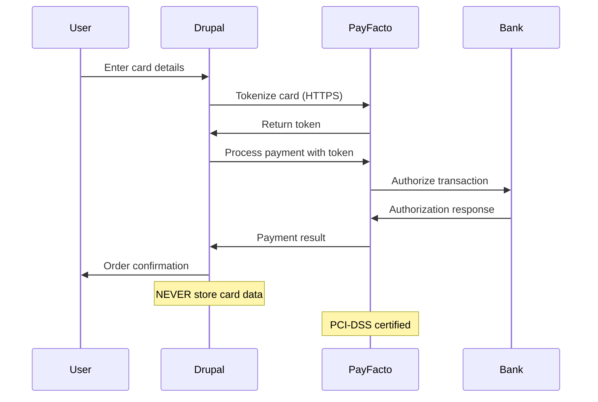
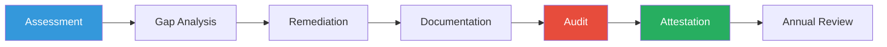
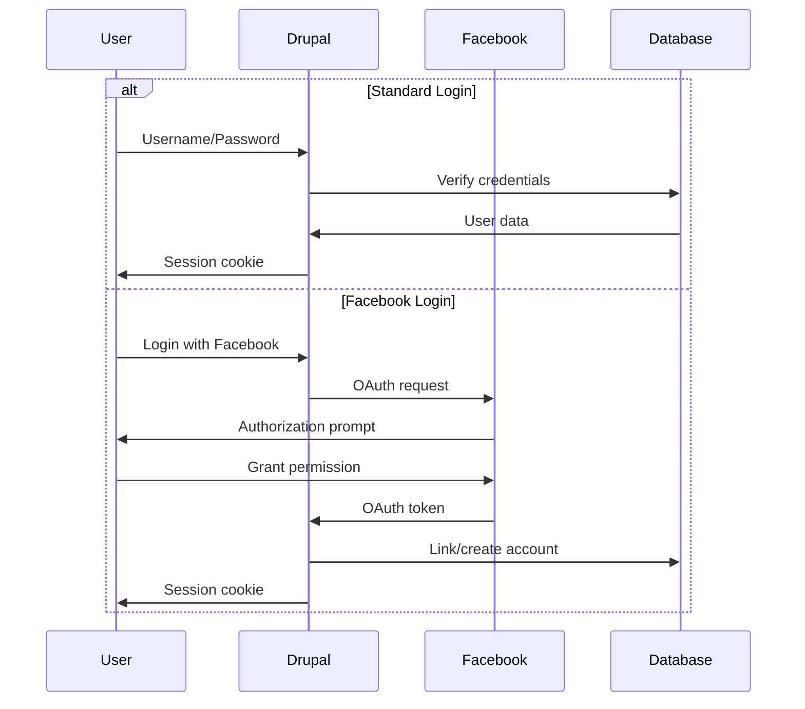
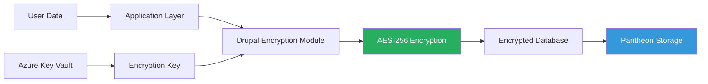
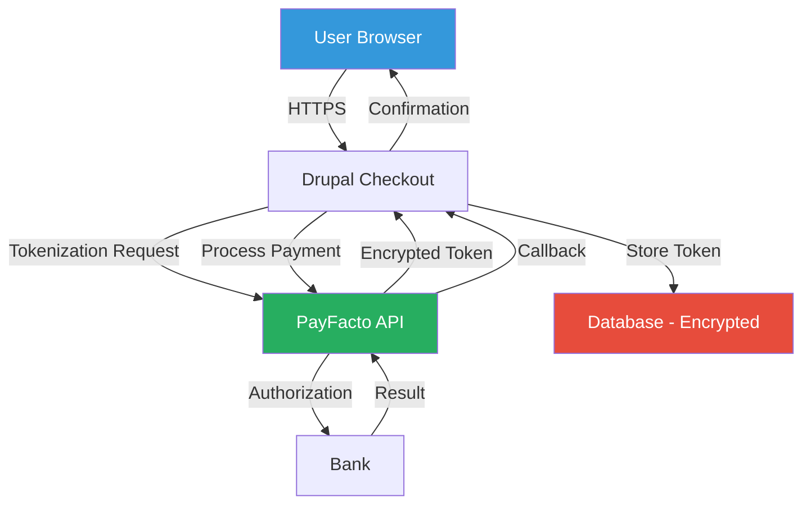
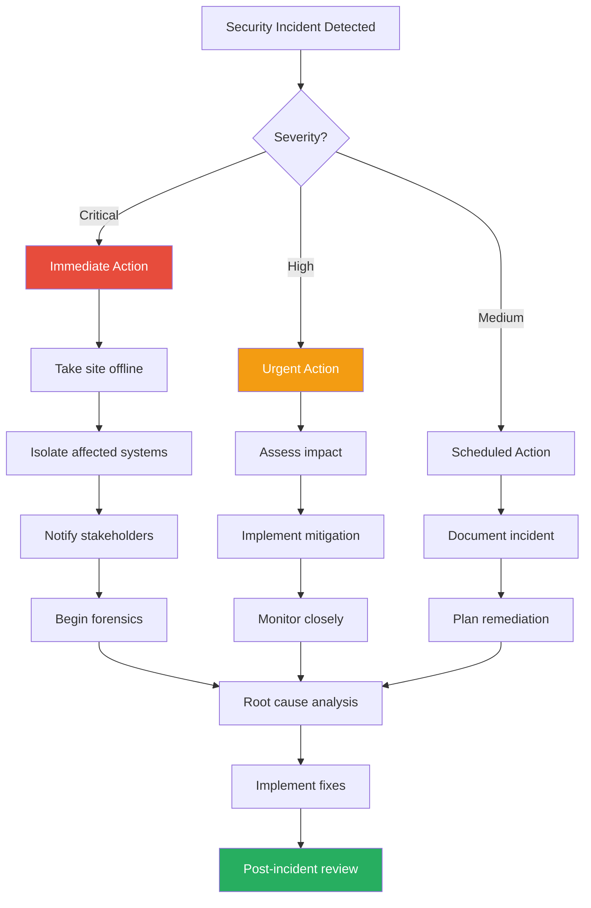

# Security Guidelines - 24h Tremblant D9

## 🔒 Table of Contents

- [Security Overview](#security-overview)
- [Critical Security Issues](#critical-security-issues)
- [PCI-DSS Compliance](#pci-dss-compliance)
- [Authentication & Authorization](#authentication--authorization)
- [Data Protection](#data-protection)
- [Payment Security](#payment-security)
- [API Security](#api-security)
- [Secrets Management](#secrets-management)
- [Security Monitoring](#security-monitoring)
- [Incident Response](#incident-response)
- [Security Checklist](#security-checklist)

---

## 🎯 Security Overview

The 24h Tremblant platform handles **sensitive financial data** and **personal information** for thousands of charity event participants. Security is paramount.

### Security Posture

| Area | Status | Risk Level |
|------|--------|------------|
| **Payment Processing** | 🔴 Needs Audit | HIGH |
| **Frontend Dependencies** | 🔴 Outdated | CRITICAL |
| **Authentication** | 🟡 Needs Review | MEDIUM |
| **Data Encryption** | 🟢 Compliant | LOW |
| **API Security** | 🟡 Partial | MEDIUM |
| **Secrets Management** | 🟡 Azure Variables | MEDIUM |

---

## 🚨 Critical Security Issues

### 1. Outdated Node.js and npm Packages (CRITICAL)

**Risk**: Known security vulnerabilities in dependencies  
**Impact**: XSS attacks, supply chain attacks, data breaches  
**CVSS Score**: 9.8 (Critical)

#### Current State
```json
{
  "node_version": "8.9.x",
  "npm_version": "5.7.0",
  "gulp_version": "3.9.x",
  "status": "END OF LIFE (2019)"
}
```

#### Known Vulnerabilities
- **Node.js 8.9.x**: 40+ high/critical CVEs
- **npm 5.x**: Multiple prototype pollution vulnerabilities
- **Gulp 3.x**: Unmaintained, security issues

#### Immediate Action Required
```bash
# Step 1: Upgrade Node.js
nvm install 18
nvm use 18

# Step 2: Audit and fix npm packages
cd docroot/themes/custom/tremblant
npm audit
npm audit fix --force

# Step 3: Update package.json
npm install --save-dev gulp@latest gulp-sass@latest

# Step 4: Test build
npm run build
```

**Deadline**: 🔴 **URGENT - Complete within 2 weeks**

---

### 2. PayFacto Payment Gateway Security (CRITICAL)

**Risk**: PCI-DSS compliance violations, payment data exposure  
**Impact**: Financial loss, regulatory fines, reputation damage  
**Compliance**: PCI-DSS Level 2 required

#### Security Requirements



#### PCI-DSS Checklist

- [ ] **Never store card data** (numbers, CVV, expiry)
- [ ] Use tokenization for all transactions
- [ ] HTTPS/TLS 1.2+ for all payment communications
- [ ] Validate PayFacto webhook signatures
- [ ] Log all payment transactions (encrypted)
- [ ] Implement rate limiting on payment endpoints
- [ ] Regular security audits (quarterly)
- [ ] Vulnerability scanning (monthly)

#### PayFacto Integration Security Review

```php
// ✅ CORRECT - Use tokenization
$payment_gateway->createPayment([
  'token' => $encrypted_token,
  'amount' => $amount,
  'currency' => 'CAD'
]);

// ❌ NEVER DO THIS - Store card data
$payment_data = [
  'card_number' => '4111111111111111', // VIOLATION
  'cvv' => '123', // VIOLATION
  'expiry' => '12/25' // VIOLATION
];
```

#### Required Actions

1. **Immediate Audit** (Within 1 week)
   - Review `commerce_payfacto` module code
   - Verify no card data storage
   - Check webhook signature validation
   - Test tokenization flow

2. **PCI-DSS Compliance** (Within 1 month)
   - Complete Self-Assessment Questionnaire (SAQ-A)
   - Implement Attestation of Compliance (AOC)
   - Vulnerability scan by approved vendor
   - Document security policies

3. **Ongoing Monitoring**
   - Monthly vulnerability scans
   - Quarterly penetration testing
   - Annual PCI audit

---

### 3. SSH Keys in Azure Pipelines (MEDIUM)

**Risk**: Credential exposure, unauthorized deployments  
**Impact**: Infrastructure compromise, data breach

#### Current Implementation
```yaml
# azure-pipelines-deploy.yml
- task: InstallSSHKey@0
  inputs:
    knownHostsEntry: $(PANTHEON_KNOWN_HOSTS)
    sshPublicKey: $(PANTHEON_SSH_PUBLIC_KEY)
    sshKeySecureFile: $(PANTHEON_SSH_PRIVATE_KEY_FILE)
```

#### Recommended Improvement

**Option 1: Azure Key Vault** (Recommended)
```yaml
- task: AzureKeyVault@2
  inputs:
    azureSubscription: 'GMA-AI-Lab-Subscription'
    KeyVaultName: 'tremblant-keyvault'
    SecretsFilter: 'pantheon-ssh-key'
    
- task: InstallSSHKey@0
  inputs:
    sshKeySecureFile: $(pantheon-ssh-key)
```

**Option 2: Rotate Keys Quarterly**
```bash
# Generate new SSH key
ssh-keygen -t ed25519 -C "azure-pipelines@24h-tremblant"

# Add to Pantheon
terminus ssh-key:add ~/.ssh/id_ed25519.pub

# Update Azure Pipeline variable
```

---

## 🛡️ PCI-DSS Compliance

### Requirements

The 24h Tremblant platform is a **Level 2 Merchant** (processes 1M-6M transactions/year).

### Compliance Roadmap



### PCI-DSS Requirements Status

| Requirement | Status | Notes |
|-------------|--------|-------|
| **1. Firewall** | 🟢 | Pantheon managed |
| **2. Default Passwords** | 🟢 | Changed |
| **3. Stored Cardholder Data** | 🟡 | Needs verification |
| **4. Encrypted Transmission** | 🟢 | HTTPS enforced |
| **5. Antivirus** | 🟢 | Pantheon managed |
| **6. Secure Systems** | 🟡 | Dependencies outdated |
| **7. Access Control** | 🟢 | Role-based |
| **8. Unique IDs** | 🟢 | Per user |
| **9. Physical Access** | 🟢 | Pantheon data center |
| **10. Logs** | 🟡 | Partial monitoring |
| **11. Security Testing** | 🔴 | Not implemented |
| **12. Security Policy** | 🟡 | Incomplete |

### Self-Assessment Questionnaire (SAQ)

The platform should complete **SAQ-A** (e-commerce with outsourced payment processing):

1. Complete online questionnaire
2. Document all controls
3. Attach evidence (screenshots, configs)
4. Sign Attestation of Compliance
5. Store for 3 years

---

## 🔐 Authentication & Authorization

### User Authentication Flow



### Password Policy

```php
// Enforce strong passwords
$config['user.settings']['password_strength'] = TRUE;
$config['password_policy'] = [
  'minimum_length' => 12,
  'require_uppercase' => TRUE,
  'require_lowercase' => TRUE,
  'require_digit' => TRUE,
  'require_special' => TRUE,
  'expiration_days' => 90,
];
```

### Role-Based Access Control (RBAC)

| Role | Permissions |
|------|-------------|
| **Anonymous** | View public content, donate |
| **Authenticated** | Create team, join team, update profile |
| **Captain** | Manage team, invite participants |
| **Volunteer** | View reports, manage participants |
| **Admin 24h** | Full access except user 1 |
| **Administrator** | Full system access |

### Session Security

```php
// settings.php
ini_set('session.cookie_httponly', 1);
ini_set('session.cookie_secure', 1);
ini_set('session.cookie_samesite', 'Strict');
ini_set('session.gc_maxlifetime', 3600); // 1 hour
```

### OAuth Security (Facebook)

```php
// Validate state parameter (CSRF protection)
if ($request->get('state') !== $_SESSION['oauth_state']) {
  throw new AccessDeniedHttpException('Invalid state parameter');
}

// Whitelist redirect URIs
$allowed_redirects = [
  'https://24htremblant.com/user/login/facebook/callback',
  'https://test-24htremblant.pantheonsite.io/user/login/facebook/callback'
];
```

---

## 🔒 Data Protection

### Encryption at Rest



### Sensitive Data Handling

**Data Classification:**

| Classification | Examples | Storage | Retention |
|----------------|----------|---------|-----------|
| **Public** | Blog posts, events | Unencrypted | Indefinite |
| **Internal** | Team names, stats | Unencrypted | 7 years |
| **Confidential** | Emails, addresses | Encrypted | 7 years |
| **Restricted** | Payment tokens | Encrypted | 90 days |

### Personal Information Protection

```php
// Anonymize user data (GDPR compliance)
function tremblant_core_anonymize_user($user) {
  $user->setEmail('anonymized_' . $user->id() . '@deleted.local');
  $user->setUsername('user_' . $user->id() . '_deleted');
  $user->set('field_first_name', 'Deleted');
  $user->set('field_last_name', 'User');
  $user->set('field_phone', NULL);
  $user->set('field_address', NULL);
  $user->save();
}
```

### Data Retention Policy

- **Active event data**: Retained for 7 years (tax receipts)
- **Archived events**: Moved to long-term storage after 1 year
- **User accounts**: Deleted after 3 years of inactivity
- **Payment logs**: Retained for 7 years (PCI requirement)
- **System logs**: Retained for 90 days

---

## 💳 Payment Security

### Payment Data Flow



### Webhook Security

```php
// Validate PayFacto webhook signature
function commerce_payfacto_validate_webhook($request) {
  $payload = $request->getContent();
  $signature = $request->headers->get('X-PayFacto-Signature');
  $secret = \Drupal::config('commerce_payfacto.settings')->get('webhook_secret');
  
  $expected_signature = hash_hmac('sha256', $payload, $secret);
  
  if (!hash_equals($expected_signature, $signature)) {
    \Drupal::logger('commerce_payfacto')->error('Invalid webhook signature');
    throw new AccessDeniedHttpException('Invalid signature');
  }
  
  return json_decode($payload, TRUE);
}
```

### Payment Gateway Configuration Security

```yaml
# Don't commit to Git
docroot/sites/default/settings.local.php:
  $config['commerce_payment.commerce_payment_gateway.payfacto']['configuration'] = [
    'merchant_id' => getenv('PAYFACTO_MERCHANT_ID'),
    'api_key' => getenv('PAYFACTO_API_KEY'),
    'mode' => 'live',
  ];
```

---

## 🔑 API Security

### API Authentication

```php
// Rate limiting for API endpoints
$rate_limit = [
  'payment' => ['limit' => 10, 'window' => 60], // 10 per minute
  'donation' => ['limit' => 20, 'window' => 60],
  'registration' => ['limit' => 5, 'window' => 300], // 5 per 5 min
];
```

### CORS Policy

```php
// services.yml
services:
  cors:
    class: Drupal\Core\EventSubscriber\CorsSubscriber
    arguments: ['@config.factory']
    tags:
      - { name: event_subscriber }

# settings.php
$config['system.cors'] = [
  'enabled' => TRUE,
  'allowedOrigins' => [
    'https://24htremblant.com',
    'https://www.24htremblant.com',
  ],
  'allowedMethods' => ['GET', 'POST', 'PUT', 'DELETE'],
  'allowedHeaders' => ['Content-Type', 'Authorization'],
];
```

### reCAPTCHA v3 Integration

```php
// Protect forms from bots
$form['recaptcha'] = [
  '#type' => 'recaptcha_v3',
  '#action' => 'donation_form',
  '#score' => 0.5, // Minimum score (0-1)
];
```

---

## 🗝️ Secrets Management

### Current Secrets Storage

| Secret | Storage | Risk Level |
|--------|---------|------------|
| Database credentials | Pantheon env vars | 🟢 Low |
| PayFacto API keys | Azure variables | 🟡 Medium |
| SSH keys | Azure secure files | 🟡 Medium |
| MailChimp API key | Config management | 🔴 High |
| Facebook OAuth | Config management | 🟡 Medium |

### Recommended: Azure Key Vault Migration

```yaml
# azure-pipelines-deploy.yml
steps:
- task: AzureKeyVault@2
  inputs:
    azureSubscription: 'GMA-AI-Lab'
    KeyVaultName: 'tremblant-prod-kv'
    SecretsFilter: '*'

- script: |
    terminus secrets:set 24h-tremblant.live PAYFACTO_API_KEY $(payfacto-api-key)
    terminus secrets:set 24h-tremblant.live MAILCHIMP_API_KEY $(mailchimp-api-key)
```

### Secret Rotation Policy

- **API Keys**: Rotate every 90 days
- **SSH Keys**: Rotate every 180 days
- **Passwords**: Rotate every 90 days
- **OAuth Secrets**: Rotate annually

### Environment Variables Best Practices

```php
// ✅ CORRECT - Use environment variables
$api_key = getenv('PAYFACTO_API_KEY');

// ❌ NEVER DO THIS - Hardcode secrets
$api_key = 'sk_live_abc123xyz'; // VIOLATION

// ❌ NEVER DO THIS - Commit secrets
# .env file
PAYFACTO_API_KEY=sk_live_abc123xyz # VIOLATION
```

---

## 📊 Security Monitoring

### Logging Strategy

```php
// docroot/modules/custom/tremblant_core/tremblant_core.module

/**
 * Log security events
 */
function tremblant_core_log_security_event($event_type, $severity, $message, $context = []) {
  \Drupal::logger('security')->log($severity, $message, $context);
  
  // Alert on critical events
  if ($severity === 'critical') {
    tremblant_core_send_security_alert($event_type, $message);
  }
}

// Example usage
tremblant_core_log_security_event(
  'payment_failure',
  'warning',
  'Payment declined for order @order_id',
  ['@order_id' => $order->id()]
);
```

### Security Events to Monitor

| Event | Severity | Action |
|-------|----------|--------|
| Failed login attempts (>5) | High | Lock account |
| Payment processing failure | Critical | Alert admin |
| Unauthorized access attempt | Critical | Block IP |
| Configuration change | Medium | Log details |
| File upload | Medium | Scan for malware |
| SQL injection attempt | Critical | Block & alert |

### Recommended: Integrate with SIEM

```yaml
# Configure log forwarding to Azure Sentinel
terminus drush 24h-tremblant.live -- config:set syslog.settings identity 24h-tremblant
terminus drush 24h-tremblant.live -- config:set syslog.settings facility LOG_LOCAL0
```

### Intrusion Detection

```bash
# Monitor for suspicious patterns
terminus drush 24h-tremblant.live -- watchdog:tail --filter="user_login_failed|access_denied"

# Set up alerts for:
# - Multiple failed logins (brute force)
# - Unusual payment patterns
# - Configuration changes
# - File system modifications
```

---

## 🚨 Incident Response

### Incident Response Plan



### Incident Severity Levels

| Level | Description | Response Time | Examples |
|-------|-------------|---------------|----------|
| **Critical** | Data breach, site down | Immediate | Payment data exposed, SQL injection |
| **High** | Service degradation | < 1 hour | DDoS attack, authentication bypass |
| **Medium** | Limited impact | < 4 hours | XSS vulnerability, minor data leak |
| **Low** | Minimal impact | < 24 hours | Information disclosure |

### Incident Response Checklist

#### Phase 1: Detection & Analysis (0-15 minutes)
- [ ] Confirm incident is legitimate
- [ ] Determine incident type and severity
- [ ] Document initial findings
- [ ] Notify incident response team

#### Phase 2: Containment (15-60 minutes)
- [ ] Isolate affected systems
- [ ] Block malicious IPs/users
- [ ] Preserve evidence (logs, database)
- [ ] Take site offline if necessary

#### Phase 3: Eradication (1-4 hours)
- [ ] Identify root cause
- [ ] Remove malicious code/access
- [ ] Patch vulnerabilities
- [ ] Reset compromised credentials

#### Phase 4: Recovery (4-24 hours)
- [ ] Restore from clean backup if needed
- [ ] Verify system integrity
- [ ] Monitor for re-compromise
- [ ] Gradually restore services

#### Phase 5: Post-Incident (1-7 days)
- [ ] Complete incident report
- [ ] Conduct lessons learned meeting
- [ ] Update security policies
- [ ] Implement preventative measures

### Emergency Contacts

| Role | Contact | Phone | Email |
|------|---------|-------|-------|
| **Security Lead** | [TBD] | [TBD] | [TBD] |
| **DevOps Lead** | [TBD] | [TBD] | [TBD] |
| **Technical Lead** | [TBD] | [TBD] | [TBD] |
| **Legal Counsel** | [TBD] | [TBD] | [TBD] |
| **Pantheon Support** | - | - | https://pantheon.io/support |
| **PayFacto Support** | [TBD] | [TBD] | [TBD] |

### Communication Plan

**Internal Communication:**
- Slack channel: `#incident-response`
- Email distribution list: `security-team@gma-ai-lab.com`
- Status page: Internal wiki

**External Communication:**
- Client notification: Within 4 hours (critical), 24 hours (high)
- Public disclosure: After remediation (if required by law)
- Regulatory reporting: Within 72 hours (data breach)

---

## ✅ Security Checklist

### Daily
- [ ] Review error logs for anomalies
- [ ] Monitor payment processing success rate
- [ ] Check for failed login attempts

### Weekly
- [ ] Review access logs
- [ ] Update modules with security patches
- [ ] Verify backup integrity

### Monthly
- [ ] Run vulnerability scan (Acunetix, Nessus)
- [ ] Review user accounts (remove inactive)
- [ ] Audit API key usage
- [ ] Check SSL certificate expiration

### Quarterly
- [ ] Rotate API keys
- [ ] Penetration testing
- [ ] Review and update security policies
- [ ] Security training for team

### Annually
- [ ] PCI-DSS audit
- [ ] Complete SAQ-A questionnaire
- [ ] Review and update incident response plan
- [ ] Third-party security assessment

---

## 📚 Security Tools & Resources

### Recommended Tools

| Tool | Purpose | Priority |
|------|---------|----------|
| **Acunetix** | Web vulnerability scanning | High |
| **Snyk** | Dependency vulnerability scanning | High |
| **Dependabot** | Automated dependency updates | High |
| **Azure Sentinel** | SIEM and security monitoring | Medium |
| **Sentry** | Error tracking and monitoring | Medium |
| **New Relic** | Performance monitoring | Low |

### Drupal Security Resources

- [Drupal Security Team](https://www.drupal.org/security)
- [Security advisories](https://www.drupal.org/security/contrib)
- [Secure coding practices](https://www.drupal.org/docs/security-in-drupal)
- [OWASP Top 10](https://owasp.org/www-project-top-ten/)

### Compliance Resources

- [PCI Security Standards Council](https://www.pcisecuritystandards.org/)
- [GDPR Compliance](https://gdpr.eu/)
- [PIPEDA (Canada)](https://www.priv.gc.ca/en/privacy-topics/privacy-laws-in-canada/the-personal-information-protection-and-electronic-documents-act-pipeda/)

---

## 🎯 Security Roadmap

### Q1 2026 (Immediate - CRITICAL)
- [ ] Upgrade Node.js to 18 LTS
- [ ] Run npm audit and fix critical vulnerabilities
- [ ] PayFacto security audit
- [ ] Implement automated security scanning (Snyk)

### Q2 2026 (Short-term - HIGH)
- [ ] Complete PCI-DSS SAQ-A
- [ ] Migrate secrets to Azure Key Vault
- [ ] Implement rate limiting on all API endpoints
- [ ] Set up security monitoring with Azure Sentinel

### Q3 2026 (Medium-term)
- [ ] Penetration testing by third party
- [ ] Implement Web Application Firewall (WAF)
- [ ] Security training for development team
- [ ] Encrypt sensitive database fields

### Q4 2026 (Long-term)
- [ ] Achieve PCI-DSS Level 1 compliance
- [ ] Implement intrusion detection system
- [ ] Regular security audits (quarterly)
- [ ] Bug bounty program

---

**Document Version**: 1.0.0  
**Last Updated**: 2026-02-26  
**Classification**: Internal - Confidential  
**Owner**: Security Team  
**Review Cycle**: Quarterly

**Next Review Date**: 2026-05-26

---

## 📝 Change Log

| Date | Version | Changes | Author |
|------|---------|---------|--------|
| 2026-02-26 | 1.0.0 | Initial comprehensive security documentation | Security Team |

---

**⚠️ IMPORTANT**: This document contains sensitive security information. Do not distribute outside the organization.