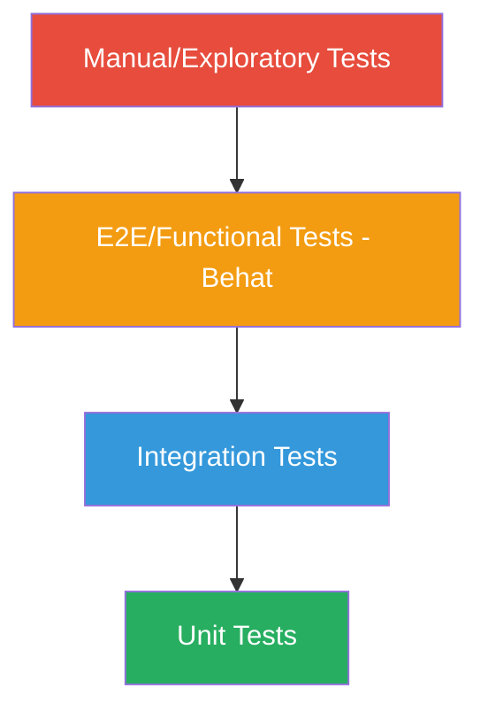
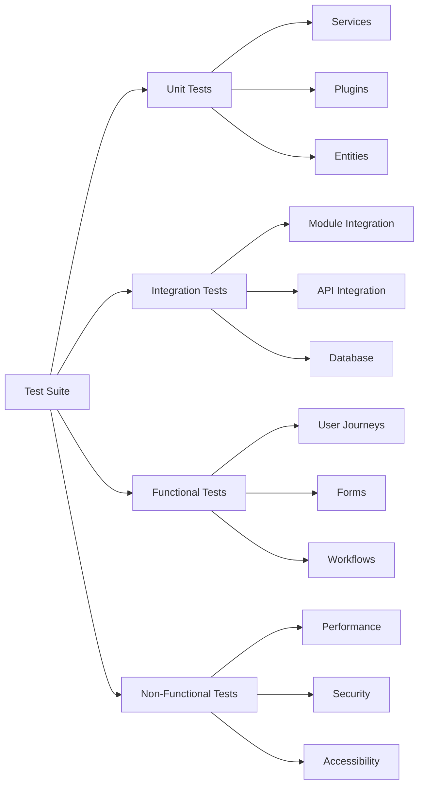

# Testing Strategy and Guide - 24h Tremblant D9

## 🧪 Table of Contents

- [Testing Overview](#testing-overview)
- [Current Testing Status](#current-testing-status)
- [Testing Strategy](#testing-strategy)
- [Unit Testing](#unit-testing)
- [Integration Testing](#integration-testing)
- [Functional Testing (Behat)](#functional-testing-behat)
- [Frontend Testing](#frontend-testing)
- [Performance Testing](#performance-testing)
- [Security Testing](#security-testing)
- [Manual Testing](#manual-testing)
- [Test Data Management](#test-data-management)
- [CI/CD Integration](#cicd-integration)
- [Testing Roadmap](#testing-roadmap)

---

## 🎯 Testing Overview

Comprehensive testing strategy for the 24h Tremblant D9 platform to ensure quality, reliability, and security across all features.

### Testing Pyramid



**Target Coverage:**
- **Unit Tests**: 70% code coverage
- **Integration Tests**: Critical workflows (payment, registration)
- **Functional Tests**: Key user journeys
- **Manual Tests**: UI/UX validation

---

## 📊 Current Testing Status

### Test Coverage Matrix

| Test Type | Status | Coverage | Priority | Target |
|-----------|--------|----------|----------|--------|
| **Unit Tests** | 🔴 Not Implemented | 0% | HIGH | 70% |
| **Integration Tests** | 🔴 Not Implemented | 0% | HIGH | 50% |
| **Behat Tests** | 🟡 Minimal | <5% | MEDIUM | 80% |
| **Frontend Tests** | 🔴 Not Implemented | 0% | MEDIUM | 60% |
| **Code Standards** | 🟢 Enforced | 100% | HIGH | 100% |
| **Manual Testing** | 🟡 Ad-hoc | N/A | LOW | N/A |

### Gaps Analysis

**Critical Gaps:**
- ❌ No unit tests for custom modules
- ❌ No payment integration tests
- ❌ No automated regression tests
- ❌ Frontend tests commented out in CI/CD

**Impact:**
- High risk of regressions during deployments
- Difficult to refactor code safely
- Extended QA time for releases
- Payment bugs may reach production

---

## 🎯 Testing Strategy

### Testing Goals

1. **Prevent Regressions**: Catch bugs before production
2. **Enable Refactoring**: Safe code improvements
3. **Document Behavior**: Tests as living documentation
4. **Improve Quality**: Reduce production bugs by 80%

### Test Categorization



---

## 🔬 Unit Testing

### Setup PHPUnit

```bash
# Install PHPUnit
composer require --dev phpunit/phpunit drupal/core-dev

# Configure PHPUnit
cp docroot/core/phpunit.xml.dist phpunit.xml

# Edit phpunit.xml
vim phpunit.xml
```

**phpunit.xml configuration:**
```xml
<phpunit bootstrap="docroot/core/tests/bootstrap.php">
  <php>
    <env name="SIMPLETEST_BASE_URL" value="http://local.24h-tremblant.com"/>
    <env name="SIMPLETEST_DB" value="mysql://db:db@db/db"/>
    <env name="BROWSERTEST_OUTPUT_DIRECTORY" value="/tmp/browser_output"/>
  </php>
  
  <testsuites>
    <testsuite name="unit">
      <directory>./docroot/modules/custom/*/tests/src/Unit</directory>
    </testsuite>
    <testsuite name="kernel">
      <directory>./docroot/modules/custom/*/tests/src/Kernel</directory>
    </testsuite>
  </testsuites>
</phpunit>
```

### Example Unit Tests

#### Test Commerce Service

```php
<?php
// docroot/modules/custom/tremblant_commerce/tests/src/Unit/DonationCalculatorTest.php

namespace Drupal\Tests\tremblant_commerce\Unit;

use Drupal\Tests\UnitTestCase;
use Drupal\tremblant_commerce\DonationCalculator;

/**
 * Tests for DonationCalculator service.
 *
 * @group tremblant_commerce
 * @coversDefaultClass \Drupal\tremblant_commerce\DonationCalculator
 */
class DonationCalculatorTest extends UnitTestCase {

  /**
   * The donation calculator service.
   *
   * @var \Drupal\tremblant_commerce\DonationCalculator
   */
  protected $calculator;

  /**
   * {@inheritdoc}
   */
  protected function setUp(): void {
    parent::setUp();
    $this->calculator = new DonationCalculator();
  }

  /**
   * @covers ::calculateTaxReceipt
   */
  public function testCalculateTaxReceipt() {
    // Test eligible donation
    $result = $this->calculator->calculateTaxReceipt(100.00);
    $this->assertEquals(100.00, $result['eligible_amount']);
    $this->assertTrue($result['is_eligible']);
    
    // Test minimum threshold
    $result = $this->calculator->calculateTaxReceipt(5.00);
    $this->assertFalse($result['is_eligible']);
    
    // Test with advantage (gala ticket)
    $result = $this->calculator->calculateTaxReceipt(150.00, 50.00);
    $this->assertEquals(100.00, $result['eligible_amount']);
  }

  /**
   * @covers ::calculateTeamProgress
   */
  public function testCalculateTeamProgress() {
    $team_total = 5000.00;
    $team_goal = 10000.00;
    
    $progress = $this->calculator->calculateTeamProgress($team_total, $team_goal);
    
    $this->assertEquals(50, $progress['percentage']);
    $this->assertEquals(5000.00, $progress['remaining']);
    $this->assertFalse($progress['goal_reached']);
  }

  /**
   * @covers ::calculateLeaderboardPosition
   */
  public function testCalculateLeaderboardPosition() {
    $teams = [
      ['id' => 1, 'total' => 15000],
      ['id' => 2, 'total' => 12000],
      ['id' => 3, 'total' => 10000],
      ['id' => 4, 'total' => 8000],
    ];
    
    $position = $this->calculator->calculateLeaderboardPosition(4, $teams);
    $this->assertEquals(4, $position);
  }
}
```

#### Test PayFacto Gateway

```php
<?php
// docroot/modules/custom/commerce_payfacto/tests/src/Unit/PayFactoGatewayTest.php

namespace Drupal\Tests\commerce_payfacto\Unit;

use Drupal\Tests\UnitTestCase;
use Drupal\commerce_payfacto\Plugin\Commerce\PaymentGateway\PayFacto;

/**
 * Tests for PayFacto payment gateway.
 *
 * @group commerce_payfacto
 * @coversDefaultClass \Drupal\commerce_payfacto\Plugin\Commerce\PaymentGateway\PayFacto
 */
class PayFactoGatewayTest extends UnitTestCase {

  /**
   * @covers ::validateWebhookSignature
   */
  public function testValidateWebhookSignature() {
    $payload = '{"transaction_id":"12345","status":"completed"}';
    $secret = 'test_secret_key';
    $signature = hash_hmac('sha256', $payload, $secret);
    
    $gateway = $this->createMock(PayFacto::class);
    $gateway->method('validateWebhookSignature')
      ->with($payload, $signature)
      ->willReturn(TRUE);
    
    $this->assertTrue($gateway->validateWebhookSignature($payload, $signature));
  }

  /**
   * @covers ::sanitizeCardData
   */
  public function testSanitizeCardData() {
    $card_data = [
      'number' => '4111111111111111',
      'cvv' => '123',
      'expiry' => '12/25',
    ];
    
    $sanitized = PayFacto::sanitizeCardData($card_data);
    
    // Should never store full card data
    $this->assertArrayNotHasKey('number', $sanitized);
    $this->assertArrayNotHasKey('cvv', $sanitized);
    $this->assertArrayHasKey('token', $sanitized);
  }
}
```

### Running Unit Tests

```bash
# Run all unit tests
vendor/bin/phpunit --testsuite=unit

# Run specific module tests
vendor/bin/phpunit docroot/modules/custom/tremblant_commerce/tests

# Run with coverage report
vendor/bin/phpunit --coverage-html coverage-report

# Run specific test
vendor/bin/phpunit --filter testCalculateTaxReceipt
```

---

## 🔗 Integration Testing

### Kernel Tests (Drupal Integration)

```php
<?php
// docroot/modules/custom/tremblant_commerce/tests/src/Kernel/OrderCreationTest.php

namespace Drupal\Tests\tremblant_commerce\Kernel;

use Drupal\KernelTests\KernelTestBase;
use Drupal\commerce_order\Entity\Order;
use Drupal\commerce_product\Entity\Product;

/**
 * Tests order creation workflow.
 *
 * @group tremblant_commerce
 */
class OrderCreationTest extends KernelTestBase {

  protected static $modules = [
    'system',
    'user',
    'commerce',
    'commerce_order',
    'commerce_product',
    'tremblant_commerce',
  ];

  /**
   * {@inheritdoc}
   */
  protected function setUp(): void {
    parent::setUp();
    
    $this->installEntitySchema('user');
    $this->installEntitySchema('commerce_order');
    $this->installEntitySchema('commerce_product');
    $this->installConfig(['commerce_order']);
  }

  /**
   * Test team creation order.
   */
  public function testTeamCreationOrder() {
    // Create team product
    $product = Product::create([
      'type' => 'team',
      'title' => 'Team Registration 2026',
      'price' => ['number' => '100.00', 'currency_code' => 'CAD'],
    ]);
    $product->save();
    
    // Create order
    $order = Order::create([
      'type' => 'team_creation',
      'state' => 'draft',
      'order_items' => [],
    ]);
    $order->save();
    
    $this->assertNotNull($order->id());
    $this->assertEquals('draft', $order->getState()->getId());
  }

  /**
   * Test donation with tax receipt.
   */
  public function testDonationWithTaxReceipt() {
    $donation_amount = 150.00;
    
    // Create donation order
    $order = Order::create([
      'type' => 'donation',
      'total_price' => ['number' => $donation_amount, 'currency_code' => 'CAD'],
    ]);
    $order->save();
    
    // Trigger tax receipt generation
    $receipt = \Drupal::service('tremblant_core.tax_receipt')
      ->generateReceipt($order);
    
    $this->assertNotNull($receipt);
    $this->assertEquals($donation_amount, $receipt['amount']);
  }
}
```

### API Integration Tests

```php
<?php
// docroot/modules/custom/tremblant_core/tests/src/Kernel/MailChimpIntegrationTest.php

namespace Drupal\Tests\tremblant_core\Kernel;

use Drupal\KernelTests\KernelTestBase;

/**
 * Tests MailChimp integration.
 *
 * @group tremblant_core
 */
class MailChimpIntegrationTest extends KernelTestBase {

  protected static $modules = [
    'mailchimp',
    'tremblant_core',
  ];

  /**
   * Test subscriber sync.
   */
  public function testSubscriberSync() {
    $email = 'test@example.com';
    $first_name = 'John';
    $last_name = 'Doe';
    
    $mailchimp = \Drupal::service('tremblant_core.mailchimp');
    
    // Mock API call
    $result = $mailchimp->subscribeUser($email, $first_name, $last_name);
    
    $this->assertTrue($result['success']);
    $this->assertEquals('subscribed', $result['status']);
  }
}
```

---

## 🎭 Functional Testing (Behat)

### Behat Configuration

```yaml
# tests/behat/behat.yml
default:
  suites:
    default:
      paths:
        - '%paths.base%/features'
      contexts:
        - FeatureContext
        - Drupal\DrupalExtension\Context\DrupalContext
        - Drupal\DrupalExtension\Context\MinkContext
        - Drupal\DrupalExtension\Context\MessageContext
        - Drupal\DrupalExtension\Context\DrushContext
  
  extensions:
    Drupal\MinkExtension:
      base_url: 'http://local.24h-tremblant.com'
      browser_name: 'chrome'
      javascript_session: selenium2
      selenium2:
        wd_host: 'http://localhost:4444/wd/hub'
    
    Drupal\DrupalExtension:
      blackbox: ~
      api_driver: 'drupal'
      drupal:
        drupal_root: '/var/www/html/docroot'
      region_map:
        header: '.header'
        content: '.main-content'
        footer: '.footer'
      selectors:
        message_selector: '.messages'
        error_message_selector: '.messages--error'
```

### Example Feature Tests

#### Team Registration Flow

```gherkin
# tests/behat/features/team-registration.feature
Feature: Team Registration
  As a user
  I want to create a team
  So that I can participate in the 24h Tremblant event

  Background:
    Given I am an anonymous user
    And the "2026" event is active

  Scenario: Successful team creation
    Given I am on "/team/create"
    When I fill in "Team Name" with "Les Coureurs du Coeur"
    And I fill in "Email" with "captain@example.com"
    And I fill in "First Name" with "John"
    And I fill in "Last Name" with "Doe"
    And I fill in "Phone" with "514-555-1234"
    And I select "Running" from "Activity"
    And I check "I accept the terms and conditions"
    And I press "Continue to Payment"
    Then I should see "Team Registration: Les Coureurs du Coeur"
    And I should see "$100.00"

  Scenario: Team creation with Facebook login
    Given I am on "/team/create"
    When I click "Continue with Facebook"
    And I login to Facebook with "facebook@example.com"
    Then I should be redirected to "/team/create?step=2"
    And my profile should be pre-filled

  Scenario: Invalid team name (already exists)
    Given a team "Les Champions" exists
    When I try to create a team with name "Les Champions"
    Then I should see an error "Team name already exists"
    And I should not be able to proceed

  Scenario: Minimum participants requirement
    Given I am creating a team
    When I try to proceed with 0 participants
    Then I should see "At least 2 participants required"

  Scenario: Team captain cannot join another team
    Given I am logged in as a team captain
    When I visit "/team/join"
    Then I should see "You are already a team captain"
    And the join form should not be visible
```

#### Donation Flow

```gherkin
# tests/behat/features/donation.feature
Feature: Donation
  As a supporter
  I want to donate to a team
  So that I can support the charity event

  Background:
    Given a team "Team A" exists with captain "captain@example.com"

  Scenario: Anonymous donation
    Given I am on the team page for "Team A"
    When I click "Donate"
    And I fill in the donation amount with "50"
    And I fill in my contact information
    And I complete the payment
    Then I should see "Thank you for your donation"
    And the team total should increase by $50
    And I should receive a confirmation email

  Scenario: Donation with tax receipt
    Given I donate $100 to "Team A"
    When the payment is completed
    Then a tax receipt should be generated
    And I should receive it by email
    And it should contain my donation amount

  Scenario: Recurring donation
    Given I am on "/donate"
    When I select "Monthly" donation
    And I set the amount to $25
    And I complete the payment
    Then a recurring payment should be set up
    And I should receive a confirmation

  @javascript
  Scenario: Donation counter updates in real-time
    Given I am on the team page for "Team A"
    When someone else donates $100
    Then the counter should update automatically
    And I should see the new total without refreshing
```

### Running Behat Tests

```bash
# Install Behat
composer require --dev drupal/drupal-extension behat/behat

# Run all tests
vendor/bin/behat

# Run specific feature
vendor/bin/behat features/team-registration.feature

# Run with specific tag
vendor/bin/behat --tags=@javascript

# Generate test report
vendor/bin/behat --format=html --out=behat-report.html
```

---

## 🎨 Frontend Testing

### JavaScript Unit Tests (Jest)

```javascript
// docroot/themes/custom/tremblant/js/__tests__/donation-counter.test.js

describe('Donation Counter', () => {
  let counter;
  
  beforeEach(() => {
    document.body.innerHTML = `
      <div class="donation-counter" data-target="10000">
        <span class="counter-value">0</span>
      </div>
    `;
    counter = new DonationCounter('.donation-counter');
  });
  
  test('initializes with correct target', () => {
    expect(counter.target).toBe(10000);
  });
  
  test('animates to new value', async () => {
    await counter.animateTo(5000);
    const value = document.querySelector('.counter-value').textContent;
    expect(parseInt(value)).toBe(5000);
  });
  
  test('formats currency correctly', () => {
    const formatted = counter.formatCurrency(1234.56);
    expect(formatted).toBe('$1,234.56');
  });
  
  test('handles real-time updates', () => {
    const mockSocket = { on: jest.fn() };
    counter.setupWebSocket(mockSocket);
    expect(mockSocket.on).toHaveBeenCalledWith('donation', expect.any(Function));
  });
});
```

### CSS Regression Tests (BackstopJS)

```javascript
// backstop.json
{
  "id": "tremblant_visual_regression",
  "viewports": [
    {
      "label": "phone",
      "width": 375,
      "height": 667
    },
    {
      "label": "tablet",
      "width": 768,
      "height": 1024
    },
    {
      "label": "desktop",
      "width": 1920,
      "height": 1080
    }
  ],
  "scenarios": [
    {
      "label": "Homepage",
      "url": "http://local.24h-tremblant.com",
      "selectors": ["document"],
      "misMatchThreshold": 0.1
    },
    {
      "label": "Team Page",
      "url": "http://local.24h-tremblant.com/team/1",
      "selectors": [".team-header", ".team-stats", ".donation-form"]
    },
    {
      "label": "Leaderboard",
      "url": "http://local.24h-tremblant.com/classement",
      "selectors": [".leaderboard-table"]
    }
  ],
  "paths": {
    "bitmaps_reference": "tests/visual/reference",
    "bitmaps_test": "tests/visual/test",
    "html_report": "tests/visual/report"
  }
}
```

### Accessibility Tests (Pa11y)

```javascript
// tests/accessibility/pa11y-config.js
module.exports = {
  standard: 'WCAG2AA',
  timeout: 10000,
  chromeLaunchConfig: {
    args: ['--no-sandbox']
  },
  urls: [
    'http://local.24h-tremblant.com',
    'http://local.24h-tremblant.com/team/create',
    'http://local.24h-tremblant.com/donate',
    'http://local.24h-tremblant.com/classement',
  ],
  actions: [
    'wait for element .page-loaded to be visible'
  ]
};
```

```bash
# Run accessibility tests
npm run test:a11y

# Example output
✓ http://local.24h-tremblant.com - 0 errors, 2 warnings
✗ http://local.24h-tremblant.com/donate - 3 errors
  • Form label missing for input#amount
  • Insufficient color contrast ratio
  • Missing alt text for image
```

### Frontend Linting

```bash
# JavaScript linting (ESLint)
npm run lint:js

# CSS linting (Stylelint)
npm run lint:css

# Fix auto-fixable issues
npm run lint:js:fix
npm run lint:css:fix
```

---

## ⚡ Performance Testing

### Load Testing with K6

```javascript
// tests/performance/load-test.js
import http from 'k6/http';
import { check, sleep } from 'k6';

export let options = {
  stages: [
    { duration: '2m', target: 10 },   // Ramp up to 10 users
    { duration: '5m', target: 50 },   // Stay at 50 users
    { duration: '2m', target: 100 },  // Spike to 100 users
    { duration: '5m', target: 100 },  // Stay at 100 users
    { duration: '2m', target: 0 },    // Ramp down
  ],
  thresholds: {
    http_req_duration: ['p(95)<2000'], // 95% of requests under 2s
    http_req_failed: ['rate<0.01'],    // Error rate under 1%
  },
};

export default function() {
  // Test homepage
  let res = http.get('https://24htremblant.com');
  check(res, {
    'homepage status 200': (r) => r.status === 200,
    'homepage load time < 3s': (r) => r.timings.duration < 3000,
  });
  
  sleep(1);
  
  // Test team page
  res = http.get('https://24htremblant.com/equipe/team-a');
  check(res, {
    'team page status 200': (r) => r.status === 200,
  });
  
  sleep(2);
  
  // Test leaderboard
  res = http.get('https://24htremblant.com/classement');
  check(res, {
    'leaderboard status 200': (r) => r.status === 200,
  });
}
```

```bash
# Run performance test
k6 run tests/performance/load-test.js

# Run with output
k6 run --out json=results.json tests/performance/load-test.js
```

### Database Query Performance

```php
<?php
// docroot/modules/custom/tremblant_classement/tests/src/Kernel/LeaderboardPerformanceTest.php

namespace Drupal\Tests\tremblant_classement\Kernel;

use Drupal\KernelTests\KernelTestBase;

/**
 * Tests leaderboard query performance.
 *
 * @group tremblant_classement
 */
class LeaderboardPerformanceTest extends KernelTestBase {

  /**
   * Test leaderboard query with 1000 teams.
   */
  public function testLeaderboardQueryPerformance() {
    // Create 1000 test teams
    for ($i = 0; $i < 1000; $i++) {
      $this->createTeam("Team $i", rand(0, 100000));
    }
    
    // Measure query time
    $start = microtime(TRUE);
    $leaderboard = \Drupal::service('tremblant_classement.service')
      ->getLeaderboard();
    $duration = microtime(TRUE) - $start;
    
    // Query should complete in under 1 second
    $this->assertLessThan(1.0, $duration);
    $this->assertCount(1000, $leaderboard);
  }
}
```

---

## 🔒 Security Testing

### OWASP ZAP Automated Scan

```bash
# Run ZAP scan
docker run -t owasp/zap2docker-stable zap-baseline.py \
  -t https://test-24htremblant.pantheonsite.io \
  -r zap-report.html

# Run full scan (slower, more thorough)
docker run -t owasp/zap2docker-stable zap-full-scan.py \
  -t https://test-24htremblant.pantheonsite.io \
  -r zap-full-report.html
```

### SQL Injection Tests

```php
<?php
// tests/security/SqlInjectionTest.php

namespace Drupal\Tests\tremblant_core\Functional;

use Drupal\Tests\BrowserTestBase;

/**
 * Tests SQL injection protection.
 *
 * @group security
 */
class SqlInjectionTest extends BrowserTestBase {

  /**
   * Test SQL injection in search.
   */
  public function testSearchSqlInjection() {
    $malicious_input = "' OR '1'='1";
    
    $this->drupalGet('/search', [
      'query' => ['keywords' => $malicious_input]
    ]);
    
    // Should not expose database errors
    $this->assertSession()->statusCodeEquals(200);
    $this->assertSession()->pageTextNotContains('SQL');
    $this->assertSession()->pageTextNotContains('mysql');
  }

  /**
   * Test SQL injection in team search.
   */
  public function testTeamSearchSqlInjection() {
    $malicious_input = "1; DROP TABLE teams; --";
    
    $this->drupalPostForm('/admin/teams/search', [
      'team_name' => $malicious_input
    ], 'Search');
    
    // Verify tables still exist
    $database = \Drupal::database();
    $this->assertTrue($database->schema()->tableExists('teams'));
  }
}
```

### XSS (Cross-Site Scripting) Tests

```php
<?php
/**
 * Tests XSS protection.
 *
 * @group security
 */
class XssProtectionTest extends BrowserTestBase {

  /**
   * Test XSS in team name.
   */
  public function testTeamNameXss() {
    $xss_input = '<script>alert("XSS")</script>';
    
    $this->drupalLogin($this->createUser(['create team']));
    $this->drupalPostForm('/team/create', [
      'name' => $xss_input
    ], 'Create Team');
    
    // Verify script is escaped
    $this->assertSession()->responseNotContains('<script>');
    $this->assertSession()->responseContains(htmlspecialchars($xss_input));
  }
}
```

---

## 👨‍💻 Manual Testing

### Test Cases Checklist

#### Team Creation
- [ ] Create team with valid data
- [ ] Create team with Facebook login
- [ ] Validate required fields
- [ ] Test duplicate team name prevention
- [ ] Test minimum participants requirement
- [ ] Test captain profile auto-fill
- [ ] Test payment gateway integration

#### Donation Flow
- [ ] Anonymous donation
- [ ] Logged-in user donation
- [ ] Recurring donation setup
- [ ] Tax receipt generation ($20+)
- [ ] Payment failure handling
- [ ] Donation counter real-time update
- [ ] Email confirmation sent

#### Leaderboard
- [ ] Verify ranking accuracy
- [ ] Test filtering (activity, region)
- [ ] Test pagination
- [ ] Test search functionality
- [ ] Verify real-time updates
- [ ] Test export to CSV

#### Admin Functions
- [ ] Archive old events
- [ ] Generate reports
- [ ] Export to Google Sheets
- [ ] MailChimp sync
- [ ] User management
- [ ] Content moderation

---

## 🗂️ Test Data Management

### Test Database Setup

```bash
# Create test database from production
terminus backup:get 24h-tremblant.live --element=db --to=test-db.sql.gz
gunzip test-db.sql.gz

# Anonymize sensitive data
mysql test_db < tests/fixtures/anonymize-data.sql

# Import to DDEV
ddev import-db --src=test-db.sql
```

### Anonymization Script

```sql
-- tests/fixtures/anonymize-data.sql

-- Anonymize user data
UPDATE users_field_data 
SET 
  mail = CONCAT('user_', uid, '@example.com'),
  name = CONCAT('user_', uid),
  pass = '$S$D...'; -- Default test password hash

-- Anonymize participant profiles
UPDATE profile 
SET 
  field_first_name = 'Test',
  field_last_name = CONCAT('User ', profile_id),
  field_email = CONCAT('test_', profile_id, '@example.com'),
  field_phone = NULL;

-- Sanitize payment data (keep tokens only)
UPDATE commerce_payment 
SET 
  remote_id = CONCAT('test_', payment_id);
```

### Test Fixtures

```php
<?php
// tests/fixtures/TestDataFactory.php

namespace Drupal\Tests\tremblant_core\Traits;

trait TestDataFactory {

  /**
   * Create test team.
   */
  protected function createTestTeam($name = 'Test Team', $goal = 10000) {
    $team = \Drupal::entityTypeManager()
      ->getStorage('commerce_order')
      ->create([
        'type' => 'team',
        'title' => $name,
        'field_goal' => $goal,
        'field_participants' => [],
      ]);
    $team->save();
    return $team;
  }

  /**
   * Create test donation.
   */
  protected function createTestDonation($amount = 50, $team_id = NULL) {
    $donation = \Drupal::entityTypeManager()
      ->getStorage('commerce_order')
      ->create([
        'type' => 'donation',
        'total_price' => ['number' => $amount, 'currency_code' => 'CAD'],
        'field_team' => $team_id,
      ]);
    $donation->save();
    return $donation;
  }
}
```

---

## 🤖 CI/CD Integration

### Azure Pipelines Test Stage

```yaml
# azure-pipelines-test.yml
trigger:
  branches:
    include:
      - master
      - sbox2

stages:
- stage: Test
  jobs:
  - job: UnitTests
    pool:
      vmImage: 'ubuntu-latest'
    steps:
    - task: UsePhpVersion@0
      inputs:
        versionSpec: '8.3'
    
    - script: |
        composer install --no-interaction
        vendor/bin/phpunit --testsuite=unit --coverage-text
      displayName: 'Run PHPUnit Tests'
    
    - task: PublishTestResults@2
      inputs:
        testResultsFormat: 'JUnit'
        testResultsFiles: '**/test-results.xml'
  
  - job: CodeQuality
    pool:
      vmImage: 'ubuntu-latest'
    steps:
    - script: |
        vendor/bin/phpcs --standard=Drupal,DrupalPractice \
          docroot/modules/custom \
          --report=junit \
          --report-file=phpcs-report.xml
      displayName: 'Code Standards'
  
  - job: SecurityScan
    pool:
      vmImage: 'ubuntu-latest'
    steps:
    - script: |
        composer audit
        npm audit --audit-level=high
      displayName: 'Security Audit'
  
  - job: BehatTests
    pool:
      vmImage: 'ubuntu-latest'
    steps:
    - script: |
        vendor/bin/behat --format=junit --out=behat-results
      displayName: 'Run Behat Tests'
```

### GitHub Actions Alternative

```yaml
# .github/workflows/tests.yml
name: Tests

on:
  pull_request:
  push:
    branches: [master, sbox2]

jobs:
  phpunit:
    runs-on: ubuntu-latest
    steps:
      - uses: actions/checkout@v3
      
      - name: Setup PHP
        uses: shivammathur/setup-php@v2
        with:
          php-version: '8.3'
          extensions: mbstring, xml, pdo_mysql
      
      - name: Install dependencies
        run: composer install
      
      - name: Run tests
        run: vendor/bin/phpunit --coverage-clover coverage.xml
      
      - name: Upload coverage
        uses: codecov/codecov-action@v3
        with:
          files: ./coverage.xml
```

---

## 🗺️ Testing Roadmap

### Phase 1: Foundation (Q1 2026) - 🔴 CRITICAL

**Goals:**
- Set up testing infrastructure
- Achieve 30% code coverage
- Implement critical path tests

**Tasks:**
- [ ] Configure PHPUnit for all custom modules
- [ ] Write unit tests for core services
  - [ ] `tremblant_commerce` (payment, order creation)
  - [ ] `tremblant_classement` (rankings)
  - [ ] `commerce_payfacto` (payment gateway)
- [ ] Set up Behat for functional testing
- [ ] Write Behat tests for critical user journeys
  - [ ] Team registration
  - [ ] Donation flow
  - [ ] Payment processing
- [ ] Integrate tests into Azure Pipelines
- [ ] Set up code coverage tracking

**Success Metrics:**
- ✅ 30% code coverage
- ✅ 10 critical Behat scenarios passing
- ✅ All PRs require passing tests

---

### Phase 2: Expansion (Q2 2026) - 🟡 HIGH

**Goals:**
- Increase coverage to 50%
- Add integration tests
- Implement frontend testing

**Tasks:**
- [ ] Expand unit test coverage to all custom modules
- [ ] Add kernel tests for module integrations
- [ ] Set up frontend testing with Jest
- [ ] Implement visual regression tests with BackstopJS
- [ ] Add accessibility tests with Pa11y
- [ ] Create test data factory
- [ ] Document testing guidelines

**Success Metrics:**
- ✅ 50% code coverage
- ✅ 30+ Behat scenarios
- ✅ Frontend test suite with 60% coverage

---

### Phase 3: Maturity (Q3 2026) - 🟢 MEDIUM

**Goals:**
- Achieve 70% coverage target
- Add performance and security tests
- Optimize test execution time

**Tasks:**
- [ ] Complete unit test coverage for all modules
- [ ] Add performance tests with K6
- [ ] Implement security tests (OWASP ZAP, SQL injection)
- [ ] Set up mutation testing
- [ ] Optimize test suite (parallel execution)
- [ ] Create test reporting dashboard
- [ ] Regular test review and refactoring

**Success Metrics:**
- ✅ 70% code coverage
- ✅ Performance benchmarks established
- ✅ Security tests integrated into CI/CD

---

### Phase 4: Excellence (Q4 2026) - 🎯 ONGOING

**Goals:**
- Maintain high test coverage
- Continuous improvement
- Advanced testing practices

**Tasks:**
- [ ] Implement contract testing for API integrations
- [ ] Add chaos engineering tests
- [ ] Set up production monitoring and synthetic tests
- [ ] Create automated test generation tools
- [ ] Regular training on testing best practices
- [ ] Contribute tests back to contrib modules

**Success Metrics:**
- ✅ 70%+ code coverage maintained
- ✅ < 5% production bugs
- ✅ < 10 min test execution time

---

## 📚 Testing Resources

### Tools

| Tool | Purpose | Documentation |
|------|---------|---------------|
| **PHPUnit** | Unit testing | https://phpunit.de/ |
| **Behat** | Functional testing | https://behat.org/ |
| **Jest** | JavaScript testing | https://jestjs.io/ |
| **K6** | Load testing | https://k6.io/ |
| **BackstopJS** | Visual regression | https://github.com/garris/BackstopJS |
| **Pa11y** | Accessibility | https://pa11y.org/ |
| **OWASP ZAP** | Security scanning | https://www.zaproxy.org/ |

### Drupal Testing Guides

- [Drupal Testing Documentation](https://www.drupal.org/docs/testing)
- [PHPUnit in Drupal](https://www.drupal.org/docs/testing/phpunit-in-drupal)
- [Behat for Drupal](https://www.drupal.org/project/drupalextension)

### Best Practices

- Write tests before fixing bugs (TDD)
- Keep tests simple and focused
- Use descriptive test names
- Mock external dependencies
- Maintain test data fixtures
- Run tests locally before committing
- Review test failures immediately

---

**Document Version**: 1.0.0  
**Last Updated**: 2026-02-26  
**Owner**: QA Team  
**Review Cycle**: Quarterly

---

## 📝 Change Log

| Date | Version | Changes | Author |
|------|---------|---------|--------|
| 2026-02-26 | 1.0.0 | Initial comprehensive testing documentation | QA Team |